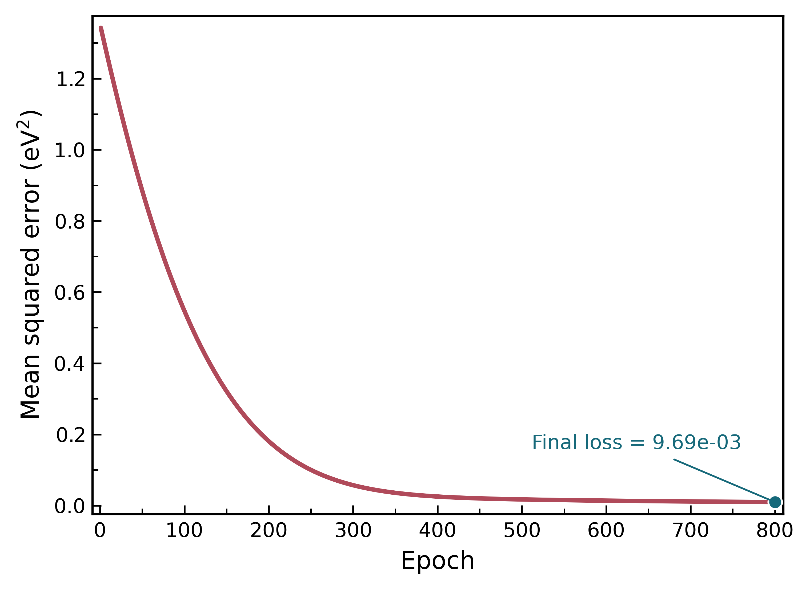
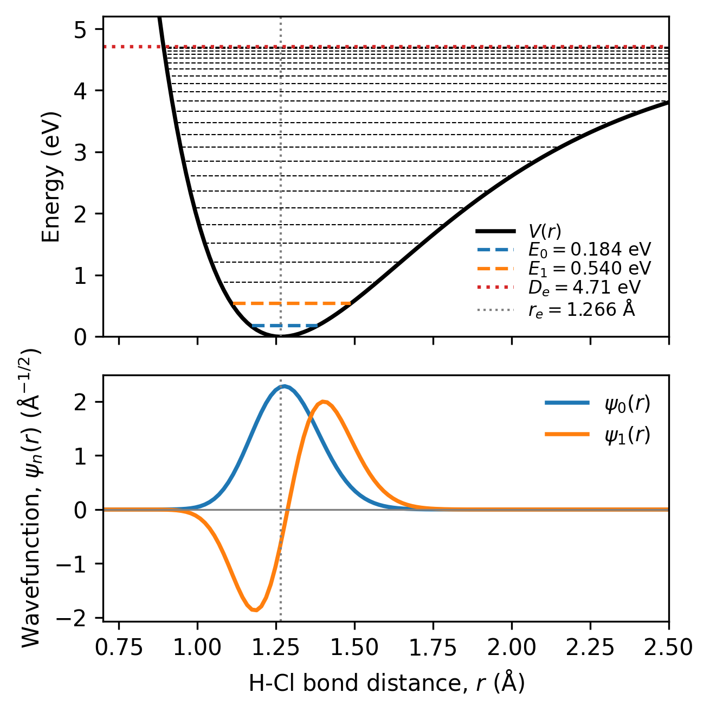

HCl Morse-Potential Parameter Learning and Vibrational Eigenstates
==================================================================

Overview
--------

This tutorial models the vibrational motion of hydrogen chloride (HCl)
using a 1-D quantum Morse oscillator. Unlike the simple
harmonic oscillator, which represents a molecular bond using a symmetric
parabolic potential, the Morse oscillator accounts for bond anharmonicity,
the decreasing separation between higher vibrational energy levels, and
eventual bond dissociation [#morse]_ [#nasser]_. It therefore provides a more realistic
description of molecular vibrations.

.. important::

   This is an advanced tutorial. Before beginning this tutorial, complete the
   :doc:`basic Quantum Harmonic Oscillator tutorial <quantum_SHO>`,
   which introduces vibrational energy levels and wavefunctions using the simple
   harmonic oscillator model.

.. admonition:: Problem statement
   :class: note

   Model the HCl bond vibration as a 1-D quantum Morse oscillator.
   Learn the Morse-potential parameters and use these to calculate the
   ground and first-excited vibrational states. Determine the fundamental
   vibrational transition of HCl from the difference between their
   energies.

Physical model
--------------

The vibrational motion is described by the
1-D time-independent Schrödinger equation. [#griffiths]_

.. math::
   \hat H\psi_v(r)=E_v\psi_v(r),

where

* :math:`r` is the H--Cl internuclear distance,
* :math:`v` is the vibrational quantum number,
* :math:`\psi_v(r)` is the vibrational wavefunction, and
* :math:`E_v` is the corresponding vibrational energy.

Hamiltonian operator
~~~~~~~~~~~~~~~~~~~~

The vibrational Hamiltonian is a continuous differential operator:

.. math::
   \hat H =
   -\frac{\hbar^2}{2\mu}\frac{d^2}{dr^2}+V(r).

The first term is the nuclear kinetic-energy operator, and the second term is
the potential-energy operator.

Reduced mass
^^^^^^^^^^^^

The relative vibrational motion of the H and Cl nuclei is described using the
reduced mass

.. math::
   \mu =
   \frac{m_{\mathrm H}m_{\mathrm{Cl}}}
        {m_{\mathrm H}+m_{\mathrm{Cl}}}.

Using ``mass_H_u = 1.00784`` and ``mass_Cl_u = 35.45`` gives

.. math::
   \mu = 1.6272938883\times 10^{-27}\ \mathrm{kg}.

Potential-energy operator
^^^^^^^^^^^^^^^^^^^^^^^^^

The H--Cl interaction is represented by the standard Morse potential. [#morse]_

.. math::
   V(r)=D_e\left[1-\exp\left(-\alpha(r-r_e)\right)\right]^2,

where :math:`D_e` is the Morse well depth, :math:`r_e` is the equilibrium
bond length, and :math:`\alpha` determines the width and curvature of the potential well.

Finite-difference Hamiltonian representation
^^^^^^^^^^^^^^^^^^^^^^^^^^^^^^^^^^^^^^^^^^^^

To solve the equation numerically, the continuous wavefunction is replaced by
a vector of grid values, and the derivative is replaced by a finite-difference
formula. [#fornberg]_

At an interior point :math:`r_i`, the second derivative is approximated using
the central finite-difference expression

.. math::

   \left.
   \frac{d^2\psi}{dr^2}
   \right|_{r_i}
   \approx
   \frac{
   \psi_{i+1}-2\psi_i+\psi_{i-1}
   }{(\Delta r)^2}.

Substitution into the kinetic-energy operator gives

.. math::

   -\frac{\hbar^2}{2\mu}
   \left.
   \frac{d^2\psi}{dr^2}
   \right|_{r_i}
   \approx
   -C\psi_{i-1}
   +2C\psi_i
   -C\psi_{i+1},

where

.. math::

   C
   =
   \frac{\hbar^2}
        {2\mu(\Delta r)^2}.

Adding the potential-energy contribution gives

.. math::

   (H\psi)_i
   =
   -C\psi_{i-1}
   +
   \left(2C+V_i\right)\psi_i
   -
   C\psi_{i+1}.

This linear relation is mathematically equivalent to multiplication by the
tridiagonal matrix

.. math::

   H
   =
   \begin{pmatrix}
   2C+V_1 & -C & 0 & \cdots & 0\\
   -C & 2C+V_2 & -C & \ddots & \vdots\\
   0 & -C & 2C+V_3 & \ddots & 0\\
   \vdots & \ddots & \ddots & \ddots & -C\\
   0 & \cdots & 0 & -C & 2C+V_N
   \end{pmatrix}.

The diagonal elements contain both kinetic- and potential-energy
contributions:

.. math::

   H_{ii}=2C+V_i.

The immediately adjacent off-diagonal elements arise from the
finite-difference kinetic-energy operator:

.. math::

   H_{i,i-1}=H_{i,i+1}=-C.

All remaining elements are zero. Therefore,

.. math::

   H_{ij}
   =
   \begin{cases}
   2C+V_i, & i=j,\\
   -C, & |i-j|=1,\\
   0, & \text{otherwise}.
   \end{cases}

Boundary conditions
~~~~~~~~~~~~~~~~~~~

The coordinate interval is

.. math::

   r_{\min}=0.50\ \mathrm{\AA},
   \qquad
   r_{\max}=2.00\ \mathrm{\AA}.

The code stores ``N_grid = 100`` interior points.  The spacing is

.. math::

   \Delta r
   =
   \frac{r_{\max}-r_{\min}}{N_{\mathrm{grid}}+1}
   =
   \frac{2.00-0.50}{101}\ \mathrm{\AA}
   \approx0.0148515\ \mathrm{\AA}.

The stored coordinate runs from

.. math::

   r_1=r_{\min}+\Delta r

to

.. math::

   r_{N_{\mathrm{grid}}}=r_{\max}-\Delta r.

The wavefunction values are stored only at the interior grid points. Values
outside the interior grid are taken to be zero, which imposes Dirichlet
boundary conditions:

.. math::

   \psi(r_{\min})=0,

.. math::

   \psi(r_{\max})=0.

.. note::

   Higher vibrational states extend farther toward larger bond distances and
   contain more nodes. Therefore, ``r_max`` and ``N_grid`` should be increased
   to ensure that the wavefunctions vanish near the boundary and remain
   adequately resolved. Convergence should be checked by repeating the
   calculation with larger values.

Part 1. Learning the Morse parameters
-------------------------------------

Part 1 uses published i-DMFT bond distances and potential energies for
HCl as the reference dataset. [#liu]_

The Morse parameters are learned by minimizing the mean squared error

.. math::

   \mathcal L(D_e,\alpha,r_e)=\frac{1}{N}\sum_{k=1}^{N}\left[V_{\mathrm{Morse}}(r_k;D_e,\alpha,r_e)-V_k^{\mathrm{ref}}\right]^2,

where :math:`V_{\mathrm{Morse}}(r_k;D_e,\alpha,r_e)` is the energy
predicted by the Morse potential at the :math:`k`-th HCl bond distance,
:math:`V_k^{\mathrm{ref}}` is the corresponding reference energy from
the published HCl potential-energy data, and :math:`N` is the total
number of reference data points. 

Gradients of the loss with respect to each parameter are evaluated with
``grad``. Adam then combines exponentially weighted first and second gradient
moments with bias correction. [#kingma]_ The three learning rates are parameter-specific
because the numerical scales and sensitivities of :math:`D_e`, :math:`\alpha`,
and :math:`r_e` differ.

1.1 Parameter-learning helper functions
~~~~~~~~~~~~~~~~~~~~~~~~~~~~~~~~~~~~~~~

.. code-block:: python

   # Helper functions for Part 1: Parameter learning
   
   def zero_array(length: ℕ): ℝ[m]:
       values: ℝ[length] = for index: ℕ(length) -> index * 0.0
       return values
   
   def morse_model_potential(dissociation_eV: ℝ, α_inverse_angstrom: ℝ, equilibrium_angstrom: ℝ): ℝ[m]:
       model_potential: ℝ[N_reference_points] = zero_array(N_reference_points)
       for reference_index: ℕ(0, N_reference_points):
           model_potential[reference_index] = dissociation_eV * (1.0 - exp(-α_inverse_angstrom * (reference_bond_distance_angstrom[reference_index] - equilibrium_angstrom)))**2
       return model_potential
   
   def morse_parameter_loss(dissociation_eV: ℝ, α_inverse_angstrom: ℝ, equilibrium_angstrom: ℝ): ℝ:
       predicted: ℝ[N_reference_points] = morse_model_potential(dissociation_eV, α_inverse_angstrom, equilibrium_angstrom)
       total_loss: ℝ = 0.0
       error: ℝ = 0.0
       for reference_index: ℕ(0, N_reference_points):
           error = predicted[reference_index] - reference_potential_eV[reference_index]
           total_loss = total_loss + error**2
       return total_loss / (N_reference_points * 1.0)
   
   def loss_with_respect_to_dissociation(dissociation_eV: ℝ): ℝ:
       return morse_parameter_loss(dissociation_eV, learned_α_inverse_angstrom, learned_equilibrium_distance_angstrom)
   
   def loss_with_respect_to_α(α_inverse_angstrom: ℝ): ℝ:
       return morse_parameter_loss(learned_dissociation_energy_eV, α_inverse_angstrom, learned_equilibrium_distance_angstrom)
   
   def loss_with_respect_to_equilibrium(equilibrium_angstrom: ℝ): ℝ:
       return morse_parameter_loss(learned_dissociation_energy_eV, learned_α_inverse_angstrom, equilibrium_angstrom)
   
   def adam(parameter: ℝ, gradient_value: ℝ, first_moment: ℝ, second_moment: ℝ, step: ℝ, learning_rate: ℝ): ℝ[4]:
       β_1: ℝ = 0.9
       β_2: ℝ = 0.999
       ε: ℝ = 1.0e-8
       new_first_moment: ℝ = β_1 * first_moment + (1.0 - β_1) * gradient_value
       new_second_moment: ℝ = β_2 * second_moment + (1.0 - β_2) * gradient_value**2
       corrected_first_moment: ℝ = new_first_moment / (1.0 - β_1**step)
       corrected_second_moment: ℝ = new_second_moment / (1.0 - β_2**step)
       new_parameter: ℝ = parameter - learning_rate * corrected_first_moment / (sqrt(corrected_second_moment) + ε)
       return [new_parameter, new_first_moment, new_second_moment, step + 1.0]
                                                                                                                        

1.2 Physical constants and reference potential-energy data
~~~~~~~~~~~~~~~~~~~~~~~~~~~~~~~~~~~~~~~~~~~~~~~~~~~~~~~~~~

.. code-block:: python

   # Define physical constants and HCl reduced mass
   atomic_mass_unit: ℝ = 1.66053906660e-27
   ℏ: ℝ = 1.054571817e-34
   planck_constant: ℝ = 6.62607015e-34
   speed_of_light_cm: ℝ = 2.99792458e10
   electron_volt: ℝ = 1.602176634e-19
   inverse_angstrom_to_inverse_meter: ℝ = 1.0e10
   mass_H_u: ℝ = 1.00784
   mass_Cl_u: ℝ = 35.45
   mass_H: ℝ = mass_H_u * atomic_mass_unit
   mass_Cl: ℝ = mass_Cl_u * atomic_mass_unit
   μ_HCl: ℝ = ((mass_H * mass_Cl) / (mass_H + mass_Cl))

   # Load the published HCl potential-energy curve in angstrom and eV relative to the minimum
   N_reference_points: ℕ = 13

   reference_bond_distance_angstrom: ℝ[N_reference_points] = [1.1000, 1.2746, 1.6000, 2.1500, 2.6500, 3.2000, 3.7500, 3.9500, 4.2500, 4.5500, 4.8000, 5.0000, 5.3000]
   reference_potential_eV: ℝ[N_reference_points] = [0.68888, 0.00000, 0.97847, 3.22469, 4.23970, 4.54743, 4.60134, 4.60678, 4.61086, 4.61274, 4.61355, 4.61396, 4.61434]

The reference data points cover the repulsive wall, the equilibrium region, the
rising attractive branch, and the near-dissociation plateau. Distances are in
angstroms and energies are in electronvolts relative to the minimum. 

1.3 Learnable parameters and learning rates
~~~~~~~~~~~~~~~~~~~~~~~~~~~~~~~~~~~~~~~~~~~

The optimization begins with initial values of
:math:`D_e=3.5\ \text{eV}` for the Morse potential-well depth,
:math:`\alpha=1.5\ \text{Å}^{-1}` for the range parameter, and
:math:`r_e=1.35\ \text{Å}` for the equilibrium bond length. During
training, these parameters are adjusted to reproduce the reference HCl
potential-energy data.

.. code-block:: python

   # Initialize the learnable Morse parameters
   learned_dissociation_energy_eV: ℝ = 3.5
   learned_α_inverse_angstrom: ℝ = 1.5
   learned_equilibrium_distance_angstrom: ℝ = 1.35
   dissociation_first_moment: ℝ = 0.0
   dissociation_second_moment: ℝ = 0.0
   α_first_moment: ℝ = 0.0
   α_second_moment: ℝ = 0.0
   equilibrium_first_moment: ℝ = 0.0
   equilibrium_second_moment: ℝ = 0.0
   optimizer_step: ℝ = 1.0

   # Set the parameter-specific learning rates
   learning_rate_dissociation: ℝ = 0.005
   learning_rate_α: ℝ = 0.001
   learning_rate_equilibrium: ℝ = 0.0005

   # Initialize the training state and loss history
   learning_epochs: ℕ = 800
   dissociation_gradient: ℝ = 0.0
   α_gradient: ℝ = 0.0
   equilibrium_gradient: ℝ = 0.0
   dissociation_adam_result: ℝ[4] = [learned_dissociation_energy_eV, 0.0, 0.0, optimizer_step]
   α_adam_result: ℝ[4] = [learned_α_inverse_angstrom, 0.0, 0.0, optimizer_step]
   equilibrium_adam_result: ℝ[4] = [learned_equilibrium_distance_angstrom, 0.0, 0.0, optimizer_step]
   loss_history: ℝ[learning_epochs] = zero_array(learning_epochs)

1.4 Adam optimization loop
~~~~~~~~~~~~~~~~~~~~~~~~~~

Within each epoch, the three partial derivatives are evaluated at the current
shared parameter state. Each parameter is then updated by its own Adam moment
state. The new parameters and moments replace the old values, the post-update
loss is recorded, and the shared optimizer step is incremented.

.. code-block:: python

   # Learn the Morse parameters with Adam optimization
   for epoch: ℕ(0, learning_epochs):
       dissociation_gradient = grad(loss_with_respect_to_dissociation, learned_dissociation_energy_eV)
       α_gradient = grad(loss_with_respect_to_α, learned_α_inverse_angstrom)
       equilibrium_gradient = grad(loss_with_respect_to_equilibrium, learned_equilibrium_distance_angstrom)
       dissociation_adam_result = adam(learned_dissociation_energy_eV, dissociation_gradient, dissociation_first_moment, dissociation_second_moment, optimizer_step, learning_rate_dissociation)
       α_adam_result = adam(learned_α_inverse_angstrom, α_gradient, α_first_moment, α_second_moment, optimizer_step, learning_rate_α)
       equilibrium_adam_result = adam(learned_equilibrium_distance_angstrom, equilibrium_gradient, equilibrium_first_moment, equilibrium_second_moment, optimizer_step, learning_rate_equilibrium)
       learned_dissociation_energy_eV = dissociation_adam_result[0]
       dissociation_first_moment = dissociation_adam_result[1]
       dissociation_second_moment = dissociation_adam_result[2]
       learned_α_inverse_angstrom = α_adam_result[0]
       α_first_moment = α_adam_result[1]
       α_second_moment = α_adam_result[2]
       learned_equilibrium_distance_angstrom = equilibrium_adam_result[0]
       equilibrium_first_moment = equilibrium_adam_result[1]
       equilibrium_second_moment = equilibrium_adam_result[2]
       loss_history[epoch] = morse_parameter_loss(learned_dissociation_energy_eV, learned_α_inverse_angstrom, learned_equilibrium_distance_angstrom)
       optimizer_step = optimizer_step + 1.0
                                                         
The values stored in ``loss_history`` can be used to plot how the
mean squared error changes during parameter learning.

   **Figure: Parameter-learning loss for the HCl Morse potential.** The mean
   squared error decreases with the number of training epochs as the Morse
   parameters are optimized. The final loss after 800 epochs is approximately
   :math:`9.69\times10^{-3}\ \mathrm{eV}^2`.
 
1.5 Final fit
~~~~~~~~~~~~~

After training, the code calculates the final MSE and evaluates the learned
Morse curve at the same 13 reference distances.

.. code-block:: python

   # Evaluate the final parameter-learning results
   final_learning_loss: ℝ = morse_parameter_loss(learned_dissociation_energy_eV, learned_α_inverse_angstrom, learned_equilibrium_distance_angstrom)
   learned_reference_potential_eV: ℝ[N_reference_points] = morse_model_potential(learned_dissociation_energy_eV, learned_α_inverse_angstrom, learned_equilibrium_distance_angstrom)
         

Part 2. Solving for the vibrational eigenstates
-----------------------------------------------

The eigensolver uses the learned :math:`D_e`, :math:`\alpha`, and :math:`r_e`
to construct the finite-difference Hamiltonian and obtain the two lowest
eigenvalues.

2.1 Eigensolver helper functions
~~~~~~~~~~~~~~~~~~~~~~~~~~~~~~~~~

The eigensolver helpers allocate matrices, construct a uniform grid,
approximate uniform-grid integrals, calculate Euclidean dot products, normalize
vectors, apply the tridiagonal Hamiltonian, and diagonalize the projected
Hamiltonian.

The Jacobi diagonalization helper performs the following operations:

#. It copies the projected operator into a working array and initializes
   ``Ritz_vectors`` as the identity matrix.

#. At each iteration, it searches the upper triangle of the working array for
   the largest off-diagonal magnitude:

   .. math::

      |T_{pq}|
      =
      \max_{i<j}|T_{ij}|.

#. It calculates the rotation angle:

   .. math::

      \theta
      =
      \frac{1}{2}
      \operatorname{atan2}
      \left(
      2T_{pq},
      T_{qq}-T_{pp}
      \right).

   The corresponding plane rotation is applied
   to the selected rows and columns of the working array and to the accumulated
   ``Ritz_vectors``.

#. It considers the calculation as converged when the largest off-diagonal
   magnitude satisfies

   .. math::

      \max_{p<q}|T_{pq}|
      \leq
      10^{-7},

   corresponding to ``jacobi_tolerance = 1.0e-7``.

#. After convergence, it copies the diagonal entries into ``Ritz_values`` and
   sorts the values in ascending energy order. The corresponding columns of
   ``Ritz_vectors`` are reordered in the same way.

After many rotations, the projected operator becomes approximately diagonal:

.. math::

   T
   \longrightarrow
   \begin{pmatrix}
   \varepsilon_0 & 0 & \cdots \\
   0 & \varepsilon_1 & \cdots \\
   \vdots & \vdots & \ddots
   \end{pmatrix}.

The function returns ``1`` when convergence is detected and ``0`` otherwise.

.. note::

   The Ritz values are approximate eigenvalues of the full finite-difference
   Hamiltonian. The Ritz vectors are eigenvectors in the reduced Krylov basis and must be
   reconstructed on the coordinate grid to obtain the approximate physical
   wavefunctions.

.. code-block:: python

   # Helper functions for Part 2: Eigen solver
   
   def zero_matrix(rows: ℕ, columns: ℕ): ℝ[m,n]:
       values: ℝ[rows,columns] = for index: ℕ(rows) -> for column_index: ℕ(columns) -> (index + column_index) * 0.0
       return values
   
   def linspace(start: ℝ, end: ℝ, number: ℕ): ℝ[m]:
       values: ℝ[number] = zero_array(number)
       spacing: ℝ = (end - start) / (number - 1)
       for index: ℕ(0, number):
           values[index] = start + index * spacing
       return values
   
   def integrate(values: ℝ[m], grid_spacing: ℝ, number: ℕ): ℝ:
       integral: ℝ = 0.0
       for index: ℕ(0, number):
           integral = integral + values[index] * grid_spacing
       return integral
   
   def dot_product(first: ℝ[m], second: ℝ[n], number: ℕ): ℝ:
       value: ℝ = 0.0
       for index: ℕ(0, number):
           value = value + first[index] * second[index]
       return value
   
   def normalize_vector(values: ℝ[m], number: ℕ): ℝ[m]:
       result: ℝ[number] = zero_array(number)
       norm: ℝ = sqrt(dot_product(values, values, number))
       for index: ℕ(0, number):
           result[index] = values[index] / norm
       return result
   
   def apply_hamiltonian(wavefunction: ℝ[m], potential: ℝ[n], kinetic_coefficient: ℝ, number: ℕ): ℝ[m]:
       result: ℝ[number] = zero_array(number)
       result[0] = ((2.0 * kinetic_coefficient + potential[0]) * wavefunction[0] - kinetic_coefficient * wavefunction[1])
       for index: ℕ(1, number - 1):
           result[index] = (-kinetic_coefficient * wavefunction[index - 1] + (2.0 * kinetic_coefficient + potential[index]) * wavefunction[index] - kinetic_coefficient * wavefunction[index + 1])
       result[number - 1] = (-kinetic_coefficient * wavefunction[number - 2] + (2.0 * kinetic_coefficient + potential[number - 1]) * wavefunction[number - 1])
       return result
   
   def jacobi_diagonalize(): ℕ:
       jacobi_not_converged: ℕ = 0
       jacobi_converged: ℕ = 1
       jacobi_converged_local: ℕ = jacobi_not_converged
       for index: ℕ(0, Krylov_dimension):
           Ritz_vectors[index,index] = 1.0
           for column_index: ℕ(0, Krylov_dimension):
               projected_work_matrix[index,column_index] = projected_hamiltonian[index,column_index]
       for rotation: ℕ(0, jacobi_maximum_rotations):
           jacobi_p = 0
           jacobi_q = 1
           jacobi_largest = abs(projected_work_matrix[0,1])
           for index: ℕ(0, Krylov_dimension):
               for column_index: ℕ(index + 1, Krylov_dimension):
                   if abs(projected_work_matrix[index,column_index]) > jacobi_largest:
                       jacobi_largest = abs(projected_work_matrix[index,column_index])
                       jacobi_p = index
                       jacobi_q = column_index
           if jacobi_converged_local == jacobi_not_converged:
               if jacobi_largest <= jacobi_tolerance:
                   jacobi_converged_local = jacobi_converged
           if jacobi_largest > jacobi_tolerance:
               jacobi_angle = 0.5 * atan2(2.0 * projected_work_matrix[jacobi_p,jacobi_q], projected_work_matrix[jacobi_q,jacobi_q] - projected_work_matrix[jacobi_p,jacobi_p])
               jacobi_cosine = cos(jacobi_angle)
               jacobi_sine = sin(jacobi_angle)
               jacobi_app = (projected_work_matrix[jacobi_p,jacobi_p] + 0.0)
               jacobi_aqq = (projected_work_matrix[jacobi_q,jacobi_q] + 0.0)
               jacobi_apq = (projected_work_matrix[jacobi_p,jacobi_q] + 0.0)
               for basis_index: ℕ(0, Krylov_dimension):
                   if basis_index != jacobi_p:
                       if basis_index != jacobi_q:
                           jacobi_akp = (projected_work_matrix[basis_index,jacobi_p] + 0.0)
                           jacobi_akq = (projected_work_matrix[basis_index,jacobi_q] + 0.0)
                           projected_work_matrix[basis_index,jacobi_p] = (jacobi_cosine * jacobi_akp - jacobi_sine * jacobi_akq)
                           projected_work_matrix[jacobi_p,basis_index] = (projected_work_matrix[basis_index,jacobi_p])
                           projected_work_matrix[basis_index,jacobi_q] = (jacobi_sine * jacobi_akp + jacobi_cosine * jacobi_akq)
                           projected_work_matrix[jacobi_q,basis_index] = (projected_work_matrix[basis_index,jacobi_q])
               projected_work_matrix[jacobi_p,jacobi_p] = (jacobi_cosine * jacobi_cosine * jacobi_app - 2.0 * jacobi_sine * jacobi_cosine * jacobi_apq + jacobi_sine * jacobi_sine * jacobi_aqq)
               projected_work_matrix[jacobi_q,jacobi_q] = (jacobi_sine * jacobi_sine * jacobi_app + 2.0 * jacobi_sine * jacobi_cosine * jacobi_apq + jacobi_cosine * jacobi_cosine * jacobi_aqq)
               projected_work_matrix[jacobi_p,jacobi_q] = 0.0
               projected_work_matrix[jacobi_q,jacobi_p] = 0.0
               for basis_index: ℕ(0, Krylov_dimension):
                   jacobi_vkp = Ritz_vectors[basis_index,jacobi_p] + 0.0
                   jacobi_vkq = Ritz_vectors[basis_index,jacobi_q] + 0.0
                   Ritz_vectors[basis_index,jacobi_p] = (jacobi_cosine * jacobi_vkp - jacobi_sine * jacobi_vkq)
                   Ritz_vectors[basis_index,jacobi_q] = (jacobi_sine * jacobi_vkp + jacobi_cosine * jacobi_vkq)
       for index: ℕ(0, Krylov_dimension):
           Ritz_values[index] = projected_work_matrix[index,index]
       for index: ℕ(0, Krylov_dimension - 1):
           jacobi_minimum = index
           for column_index: ℕ(index + 1, Krylov_dimension):
               if Ritz_values[column_index] < Ritz_values[jacobi_minimum]:
                   jacobi_minimum = column_index
           if jacobi_minimum != index:
               jacobi_temporary_value = Ritz_values[index] + 0.0
               Ritz_values[index] = Ritz_values[jacobi_minimum]
               Ritz_values[jacobi_minimum] = jacobi_temporary_value
               for basis_index: ℕ(0, Krylov_dimension):
                   jacobi_temporary_vector = Ritz_vectors[basis_index,index] + 0.0
                   Ritz_vectors[basis_index,index] = Ritz_vectors[basis_index,jacobi_minimum]
                   Ritz_vectors[basis_index,jacobi_minimum] = jacobi_temporary_vector
       return jacobi_converged_local
                                                                                                
If ``atan2`` is not available, add the following function in ``physika/runtime.py``:

.. code-block:: python

   def atan2(y, x):
       return torch.atan2(y, x)
       
2.2 Construction of the vibrational Hamiltonian
~~~~~~~~~~~~~~~~~~~~~~~~~~~~~~~~~~~~~~~~~~~~~~~

The finite-difference representation derived above is now constructed using
the learned Morse parameters. The code first converts the parameters to SI
units, defines the interior spatial grid, and evaluates the Morse potential
and kinetic-energy coefficient.

.. code-block:: python

   # Convert the learned Morse parameters to SI units
   dissociation_energy_eV: ℝ = learned_dissociation_energy_eV
   dissociation_energy_J: ℝ = (dissociation_energy_eV * electron_volt)
   equilibrium_distance: ℝ = learned_equilibrium_distance_angstrom * 1.0e-10
   morse_α: ℝ = learned_α_inverse_angstrom * inverse_angstrom_to_inverse_meter

   # Define the spatial grid and eigensolver dimensions
   N_grid: ℕ = 100
   N_levels: ℕ = 2
   block_size: ℕ = 2
   Krylov_dimension: ℕ = 40
   r_min: ℝ = 0.50e-10
   r_max: ℝ = 2.00e-10
   grid_spacing: ℝ = ((r_max - r_min) / (N_grid + 1))
   r_start: ℝ = r_min + grid_spacing
   r_end: ℝ = r_max - grid_spacing
   bond_distance: ℝ[N_grid] = linspace(r_start, r_end, N_grid)

   # Construct the Morse potential and finite-difference kinetic coefficient
   distance_from_equilibrium: ℝ[N_grid] = (bond_distance - equilibrium_distance)
   morse_exponential: ℝ[N_grid] = exp(-morse_α * distance_from_equilibrium)
   morse_difference: ℝ[N_grid] = (1.0 - morse_exponential)
   potential_J: ℝ[N_grid] = (dissociation_energy_J * morse_difference * morse_difference)
   potential_eV: ℝ[N_grid] = (potential_J / electron_volt)
   kinetic_coefficient_J: ℝ = ((ℏ / grid_spacing) * (ℏ / (2.0 * μ_HCl * grid_spacing)))
   kinetic_coefficient_eV: ℝ = (kinetic_coefficient_J / electron_volt)

2.3 Eigensolver initialization
~~~~~~~~~~~~~~~~~~~~~~~~~~~~~~

The first trial vector is a Gaussian centred at :math:`r_e`. Mathematically,

.. math::

   g_i
   =
   \exp\left[
   -\left(\frac{r_i-r_e}{\sigma}\right)^2
   \right],
   \qquad
   \sigma=0.20\ \mathrm{\AA}.

Each row of ``Krylov_basis`` stores one 100-component grid vector.
``H_Krylov[q]`` stores the Hamiltonian applied to that row.
``projected_hamiltonian``, ``projected_work_matrix``, and ``Ritz_vectors`` are
all :math:`40\times40`; ``Ritz_values`` contains 40 entries. The first basis row
is filled and normalized.

.. code-block:: python

   # Construct the Gaussian trial state
   trial_width: ℝ = 0.20e-10
   gaussian_argument: ℝ[N_grid] = (distance_from_equilibrium / trial_width)
   gaussian_envelope: ℝ[N_grid] = exp(-gaussian_argument * gaussian_argument)

   # Initialize the Krylov and projected eigensolver arrays
   Krylov_basis: ℝ[Krylov_dimension,N_grid] = zero_matrix(Krylov_dimension, N_grid)
   H_Krylov: ℝ[Krylov_dimension,N_grid] = zero_matrix(Krylov_dimension, N_grid)
   projected_hamiltonian: ℝ[Krylov_dimension,Krylov_dimension] = zero_matrix(Krylov_dimension, Krylov_dimension)
   projected_work_matrix: ℝ[Krylov_dimension,Krylov_dimension] = zero_matrix(Krylov_dimension, Krylov_dimension)
   Ritz_vectors: ℝ[Krylov_dimension,Krylov_dimension] = zero_matrix(Krylov_dimension, Krylov_dimension)
   Ritz_values: ℝ[Krylov_dimension] = zero_array(Krylov_dimension)
   jacobi_tolerance: ℝ = 1.0e-7
   jacobi_maximum_rotations: ℕ = 2500
   jacobi_p: ℕ = 0
   jacobi_q: ℕ = 1
   candidate: ℝ[N_grid] = zero_array(N_grid)
   overlap: ℝ = 0.0
   candidate_norm: ℝ = 0.0

   # Initialize and normalize the first Krylov basis vector
   for index: ℕ(0, N_grid):
       Krylov_basis[0,index] = gaussian_envelope[index]
   Krylov_basis[0] = normalize_vector(Krylov_basis[0], N_grid)
   
2.4 Block-Krylov projection and diagonalization
~~~~~~~~~~~~~~~~~~~~~~~~~~~~~~~~~~~~~~~~~~~~~~~

A block-Krylov subspace is constructed by repeatedly applying the
Hamiltonian and orthogonalizing each new candidate vector against the
previously accepted basis vectors. [#saad]_

Because ``block_size = 2``, ``q_index = 1`` creates the second starting vector

.. math::

   q_1^{\mathrm{candidate}}(r_i)
   =
   \frac{r_i-r_e}{\sigma}q_0(r_i).

The first vector is Gaussian-like, while the second changes sign at
:math:`r_e`. Together, these two starting vectors give the initial block distinct nodal
characters.

For ``q_index >= 2``, the candidate is generated from

.. math::

   q_j^{\mathrm{candidate}}=Hq_{j-2}.

This interleaves two Krylov chains:

.. math::

   q_0,\ Hq_0,\ H^2q_0,\ldots

and

.. math::

   q_1,\ Hq_1,\ H^2q_1,\ldots.

Every candidate is orthogonalized against all accepted vectors twice.  For an
existing vector :math:`q_k`, the overlap

.. math::

   s_k=q_k^Tq_j^{\mathrm{candidate}}

is removed:

.. math::

   q_j^{\mathrm{candidate}}
   \leftarrow
   q_j^{\mathrm{candidate}}-s_kq_k.

The second complete Gram--Schmidt pass reduces numerical loss of
orthogonality.  Finally, the candidate is normalized and stored.  Ideally,

.. math::

   q_i^Tq_j=\delta_{ij}.

.. code-block:: python

   # Build and orthogonalize the Krylov basis
   for q_index: ℕ(1, Krylov_dimension):
       if q_index < block_size:
           for index: ℕ(0, N_grid):
               candidate[index] = (gaussian_argument[index] * Krylov_basis[q_index - 1,index])
       else:
           candidate = apply_hamiltonian(Krylov_basis[q_index - block_size], potential_eV, kinetic_coefficient_eV, N_grid)
       for orthogonalization_pass: ℕ(0, 2):
           for lower: ℕ(0, q_index):
               overlap = dot_product(Krylov_basis[lower], candidate, N_grid)
               for index: ℕ(0, N_grid):
                   candidate[index] = (candidate[index] - overlap * Krylov_basis[lower,index])
       candidate_norm = sqrt(dot_product(candidate, candidate, N_grid))
       for index: ℕ(0, N_grid):
           Krylov_basis[q_index,index] = (candidate[index] / candidate_norm)

   # Apply the Hamiltonian to each Krylov basis vector
   for q_index: ℕ(0, Krylov_dimension):
       H_Krylov[q_index] = apply_hamiltonian(Krylov_basis[q_index], potential_eV, kinetic_coefficient_eV, N_grid)

   # Project the Hamiltonian into the Krylov subspace
   for row: ℕ(0, Krylov_dimension):
       for column: ℕ(row, Krylov_dimension):
           projected_hamiltonian[row,column] = dot_product(Krylov_basis[row], H_Krylov[column], N_grid)
           projected_hamiltonian[column,row] = projected_hamiltonian[row,column]

   # Diagonalize the projected Hamiltonian
   jacobi_diagonalize()
   vibrational_energies_eV: ℝ[N_levels] = zero_array(N_levels)
   ψ_raw: ℝ[N_levels,N_grid] = zero_matrix(N_levels, N_grid)

First, the Hamiltonian is applied to every basis vector. The projected
matrix elements are then calculated as

.. math::

   T_{ij}=q_i^THq_j.

Only the upper triangle is calculated explicitly.  The value is copied to the
opposite triangle because the projected Hamiltonian is real and symmetric.
The resulting :math:`40\times40` projected operator describes the action of
the vibrational Hamiltonian inside the selected Krylov subspace.

The Jacobi solver is invoked to diagonalize the projected Hamiltonian
and solve the eigenvalue equation. [#golub]_

.. math::

   T y_n = \varepsilon_n y_n,

where :math:`\varepsilon_n` and :math:`y_n` are the Ritz values and Ritz
vectors, respectively.

2.5 Vibrational-state reconstruction
~~~~~~~~~~~~~~~~~~~~~~~~~~~~~~~~~~~~

The two lowest vibrational states are reconstructed.

.. math::

   \psi_n^{\mathrm{raw}}(r_i)
   =
   \sum_{q=0}^{K-1}Q_{qi}(y_n)_q.

Here, :math:`Q_{qi}` is the value of the :math:`q`-th Krylov basis vector
at the :math:`i`-th spatial grid point, and :math:`(y_n)_q` is the
corresponding component of the :math:`n`-th Ritz vector.
Although the coefficients come from a 40-dimensional
projected eigenproblem, each reconstructed wavefunction has 100 grid values.
Each reconstructed state is first normalized using its Euclidean norm and
then normalized with respect to the spatial-grid quadrature so that

.. math::

   \int |\psi_n(r)|^2\,dr
   \approx
   \sum_j |\psi_{n,j}|^2\Delta r
   =
   1.

.. code-block:: python

   # Reconstruct the vibrational eigenstates on the spatial grid
   for n: ℕ(0, N_levels):
       vibrational_energies_eV[n] = Ritz_values[n]
       for index: ℕ(0, N_grid):
           for q_index: ℕ(0, Krylov_dimension):
               ψ_raw[n,index] = (ψ_raw[n,index] + Krylov_basis[q_index,index] * Ritz_vectors[q_index,n])
       ψ_raw[n] = normalize_vector(ψ_raw[n], N_grid)

   normalization_factor: ℝ[N_levels] = zero_array(N_levels)
   ψ: ℝ[N_levels,N_grid] = zero_matrix(N_levels, N_grid)

   # Normalize the eigenstates with the grid spacing
   for n: ℕ(0, N_levels):
       normalization_factor[n] = sqrt(integrate(ψ_raw[n] * ψ_raw[n], grid_spacing, N_grid))
       for index: ℕ(0, N_grid):
           ψ[n,index] = (ψ_raw[n,index] / normalization_factor[n])
   
2.6 Fundamental transition
~~~~~~~~~~~~~~~~~~~~~~~~~~

The fundamental transition is :math:`v=0\rightarrow1`.

.. code-block:: python

   # Calculate the fundamental transition energy, wavenumber, and wavelength
   transition_eV: ℝ = (vibrational_energies_eV[1] - vibrational_energies_eV[0])
   transition_J: ℝ = transition_eV * electron_volt
   wavenumber: ℝ = (transition_J / (planck_constant * speed_of_light_cm))
   wavelength_micrometer: ℝ = (10000.0 / wavenumber)

The equations are

.. math::

   \Delta E_{01}=E_1-E_0,

.. math::

   \widetilde{\nu}_{01}
   =
   \frac{\Delta E_{01}}{hc},

and

.. math::

   \lambda_{\mu\mathrm m}
   =
   \frac{10000}{\widetilde{\nu}_{01}}.

Since ``speed_of_light_cm`` is in :math:`\mathrm{cm\,s^{-1}}`,
``wavenumber`` is in :math:`\mathrm{cm^{-1}}`.  The factor 10000 converts the
reciprocal wavenumber in centimetres into micrometres.

2.7 Expected results
~~~~~~~~~~~~~~~~~~~~

.. code-block:: python

   # Print the eigen-solver and parameter-learning results
   physika_print(learned_dissociation_energy_eV)
   physika_print(learned_α_inverse_angstrom)
   physika_print(learned_equilibrium_distance_angstrom)
   physika_print(final_learning_loss)
   physika_print(vibrational_energies_eV[0])
   physika_print(vibrational_energies_eV[1])
   physika_print(transition_eV)
   physika_print(wavenumber)
   physika_print(wavelength_micrometer)
                                    
.. admonition:: Expected results

   | ✓ No type errors found
   | 1 ∈ ℝ
   | 4.707982540130615 ∈ ℝ
   | 1.8561298847198486 ∈ ℝ
   | 1.2656978368759155 ∈ ℝ
   | 0.00968560017645359 ∈ ℝ
   | 0.1839391589164734 ∈ ℝ
   | 0.5404319763183594 ∈ ℝ
   | 0.356492817401886 ∈ ℝ
   | 2875.308349609375 ∈ ℝ
   | 3.4778878688812256 ∈ ℝ

The leading value ``1`` is the return value of ``jacobi_diagonalize()`` and
indicates that the Jacobi diagonalization converged. The remaining values are,
in order, the learned :math:`D_e`, learned :math:`\alpha`, learned
:math:`r_e`, final MSE, :math:`E_0`, :math:`E_1`, :math:`\Delta E_{01}`,
wavenumber in :math:`\mathrm{cm}^{-1}`, and wavelength in micrometres.
The calculated fundamental transition wavenumber can be compared with
reported experimental spectroscopic data for HCl. [#huber]_

   **Figure: Morse-potential representation of the HCl molecule.** The upper panel
   shows the potential-energy curve as a function of the H--Cl internuclear
   distance, together with vibrational energy levels,
   equilibrium bond length :math:`r_e`, and Morse well depth :math:`D_e`.
   The lower panel displays the ground-state (:math:`v=0`) and first-excited-state
   (:math:`v=1`) vibrational wavefunctions, normalized over the bond-distance
   coordinate.

.. note::

   Although this tutorial calculates only the two lowest vibrational states,
   higher states can be obtained by increasing ``N_levels`` and adjusting the
   numerical parameters as needed to ensure convergence. These states
   can be used to calculate overtone transitions
   :math:`0\rightarrow n` (:math:`n\geq2`) and hot-band transitions
   :math:`1\rightarrow n` (:math:`n\geq2`).

.. admonition:: Try it yourself: Calculate the first overtone
   :class: important

   Increase ``N_levels`` and the required convergence parameters to calculate
   :math:`E_2`. Then calculate

   .. math::

      \widetilde{\nu}_{02}=\frac{E_2-E_0}{hc}

   Compare your result with :math:`2\widetilde{\nu}_{01}` and with the
   first-overtone value reported by `Holmes and Shay
   <https://chem.libretexts.org/Bookshelves/Physical_and_Theoretical_Chemistry_Textbook_Maps/Physical_Chemistry_(LibreTexts)/13%3A_Molecular_Spectroscopy/13.05%3A_Vibrational_Overtones>`_.

   **Hint:** If the current settings do not produce a converged result, adjust
   ``Krylov_dimension`` and, if necessary, ``N_grid`` and
   ``jacobi_maximum_rotations`` until :math:`E_2` is converged. For an anharmonic
   Morse oscillator, :math:`\widetilde{\nu}_{02}<2\widetilde{\nu}_{01}` because
   successive vibrational levels become more closely spaced.

2.8 Plotting (Optional)
~~~~~~~~~~~~~~~~~~~~~~~

The coordinate is converted from metres to angstroms in ``HCl_morse_oscillator.phyk``:

.. code-block:: python

   # Convert the plotting arrays to angstrom units
   bond_distance_angstrom: ℝ[N_grid] = (bond_distance / 1.0e-10)
   equilibrium_distance_angstrom: ℝ = (equilibrium_distance / 1.0e-10)
   ψ_angstrom: ℝ[N_levels,N_grid] = (sqrt(1.0e-10) * ψ)
   
   # Plot
   physika_plot(bond_distance_angstrom, potential_eV, ψ_angstrom, vibrational_energies_eV, dissociation_energy_eV, equilibrium_distance_angstrom, N_levels, N_levels)

Add the following custom ``physika_plot`` function to ``physika/runtime.py``:

.. code-block:: python

   def physika_plot(bond_distance, potential, psi, vibrational_energies_eV, dissociation_energy, equilibrium_distance, number_of_energy_levels=10, number_of_wavefunctions=2):
       import numpy as np
       import matplotlib.pyplot as plt
       def to_numpy(value):
           if hasattr(value, "detach"):
               return value.detach().cpu().numpy()
           return np.asarray(value)
       bond_distance = to_numpy(bond_distance).reshape(-1)
       potential = to_numpy(potential).reshape(-1)
       psi = to_numpy(psi)
       vibrational_energies_eV = to_numpy(vibrational_energies_eV).reshape(-1)
       dissociation_energy = float(np.asarray(to_numpy(dissociation_energy)).squeeze())
       equilibrium_distance = float(np.asarray(to_numpy(equilibrium_distance)).squeeze())
       if psi.ndim != 2:
           raise ValueError(f"psi must be a 2D array, but received shape {psi.shape}")
       if psi.shape[0] != len(bond_distance):
           if psi.shape[1] == len(bond_distance):
               psi = psi.T
           else:
               raise ValueError(f"Neither dimension of psi matches bond_distance: bond_distance={len(bond_distance)}, psi={psi.shape}")
       bound_energies = vibrational_energies_eV[vibrational_energies_eV < dissociation_energy]
       number_of_energy_levels = min(int(number_of_energy_levels), len(bound_energies))
       number_of_wavefunctions = min(int(number_of_wavefunctions), psi.shape[1], len(vibrational_energies_eV))
       fig, (ax_energy, ax_wavefunction) = plt.subplots(2, 1, figsize=(4.5, 4.5), sharex=True, gridspec_kw={"height_ratios": [1.3, 1.0]})

       # Upper panel: Morse potential and vibrational energies
       ax_energy.plot(bond_distance, potential, color="black", linewidth=1.8, label=r"$V(r)$")
       for n in range(number_of_energy_levels):
           energy = float(bound_energies[n])
           mask = potential <= energy
           if n == 0:
               color = "tab:blue"
               linewidth = 1.5
               label = rf"$E_0={energy:.3f}\ \mathrm{{eV}}$"
           elif n == 1:
               color = "tab:orange"
               linewidth = 1.5
               label = rf"$E_1={energy:.3f}\ \mathrm{{eV}}$"
           else:
               color = "black"
               linewidth = 0.5
               label = "_nolegend_"
           ax_energy.plot(bond_distance[mask], np.full_like(bond_distance[mask], energy, dtype=float), color=color, linestyle="--", linewidth=linewidth, label=label)
       ax_energy.axhline(dissociation_energy, color="tab:red", linestyle=":", linewidth=1.5, label=(rf"$D_e={dissociation_energy:.2f}\ \mathrm{{eV}}$"))
       ax_energy.axvline(equilibrium_distance, color="gray", linestyle=":", linewidth=1.0, label=(rf"$r_e={equilibrium_distance:.3f}\ \mathrm{{\AA}}$"))
       ax_energy.set_ylabel("Energy (eV)")
       ax_energy.set_ylim(0.0, max(5.2, 1.05 * dissociation_energy))
       ax_energy.legend(frameon=False, fontsize=8, loc="lower right", labelspacing=0)

       # Lower panel: normalized vibrational wavefunctions
       colors = ["tab:blue", "tab:orange"]
       for n in range(number_of_wavefunctions):
           ax_wavefunction.plot(bond_distance, psi[:, n], color=colors[n % len(colors)], linewidth=1.8, label=rf"$\psi_{n}(r)$")
       ax_wavefunction.axhline(0.0, color="gray", linewidth=0.8,)
       ax_wavefunction.axvline(equilibrium_distance, color="gray", linestyle=":", linewidth=1.0)
       ax_wavefunction.set_xlabel(r"H-Cl bond distance, $r$ ($\mathrm{\AA}$)")
       ax_wavefunction.set_ylabel(r"Wavefunction, $\psi_n(r)$ " r"($\mathrm{\AA}^{-1/2}$)")
       ax_wavefunction.legend(frameon=False, fontsize=9)
       ax_wavefunction.set_xlim(0.7, 2.5)
       plt.tight_layout()
       plt.savefig("HCl_morse_oscillator.png", dpi=300, bbox_inches="tight")
       # plt.show()
       plt.close()

Source code
-----------

The complete Physika implementation is also provided in
``tutorials/HCl_morse_oscillator.phyk``

.. code-block:: python

   # Helper functions for Part 1: Parameter learning
   
   def zero_array(length: ℕ): ℝ[m]:
       values: ℝ[length] = for index: ℕ(length) -> index * 0.0
       return values
   
   def morse_model_potential(dissociation_eV: ℝ, α_inverse_angstrom: ℝ, equilibrium_angstrom: ℝ): ℝ[m]:
       model_potential: ℝ[N_reference_points] = zero_array(N_reference_points)
       for reference_index: ℕ(0, N_reference_points):
           model_potential[reference_index] = dissociation_eV * (1.0 - exp(-α_inverse_angstrom * (reference_bond_distance_angstrom[reference_index] - equilibrium_angstrom)))**2
       return model_potential
   
   def morse_parameter_loss(dissociation_eV: ℝ, α_inverse_angstrom: ℝ, equilibrium_angstrom: ℝ): ℝ:
       predicted: ℝ[N_reference_points] = morse_model_potential(dissociation_eV, α_inverse_angstrom, equilibrium_angstrom)
       total_loss: ℝ = 0.0
       error: ℝ = 0.0
       for reference_index: ℕ(0, N_reference_points):
           error = predicted[reference_index] - reference_potential_eV[reference_index]
           total_loss = total_loss + error**2
       return total_loss / (N_reference_points * 1.0)
   
   def loss_with_respect_to_dissociation(dissociation_eV: ℝ): ℝ:
       return morse_parameter_loss(dissociation_eV, learned_α_inverse_angstrom, learned_equilibrium_distance_angstrom)
   
   def loss_with_respect_to_α(α_inverse_angstrom: ℝ): ℝ:
       return morse_parameter_loss(learned_dissociation_energy_eV, α_inverse_angstrom, learned_equilibrium_distance_angstrom)
   
   def loss_with_respect_to_equilibrium(equilibrium_angstrom: ℝ): ℝ:
       return morse_parameter_loss(learned_dissociation_energy_eV, learned_α_inverse_angstrom, equilibrium_angstrom)
   
   def adam(parameter: ℝ, gradient_value: ℝ, first_moment: ℝ, second_moment: ℝ, step: ℝ, learning_rate: ℝ): ℝ[4]:
       β_1: ℝ = 0.9
       β_2: ℝ = 0.999
       ε: ℝ = 1.0e-8
       new_first_moment: ℝ = β_1 * first_moment + (1.0 - β_1) * gradient_value
       new_second_moment: ℝ = β_2 * second_moment + (1.0 - β_2) * gradient_value**2
       corrected_first_moment: ℝ = new_first_moment / (1.0 - β_1**step)
       corrected_second_moment: ℝ = new_second_moment / (1.0 - β_2**step)
       new_parameter: ℝ = parameter - learning_rate * corrected_first_moment / (sqrt(corrected_second_moment) + ε)
       return [new_parameter, new_first_moment, new_second_moment, step + 1.0]
   
   # Define physical constants and HCl reduced mass
   atomic_mass_unit: ℝ = 1.66053906660e-27
   ℏ: ℝ = 1.054571817e-34
   planck_constant: ℝ = 6.62607015e-34
   speed_of_light_cm: ℝ = 2.99792458e10
   electron_volt: ℝ = 1.602176634e-19
   inverse_angstrom_to_inverse_meter: ℝ = 1.0e10
   mass_H_u: ℝ = 1.00784
   mass_Cl_u: ℝ = 35.45
   mass_H: ℝ = mass_H_u * atomic_mass_unit
   mass_Cl: ℝ = mass_Cl_u * atomic_mass_unit
   μ_HCl: ℝ = ((mass_H * mass_Cl) / (mass_H + mass_Cl))
   
   # Load the published HCl potential-energy curve in angstrom and eV relative to the minimum
   N_reference_points: ℕ = 13
   
   reference_bond_distance_angstrom: ℝ[N_reference_points] = [1.1000, 1.2746, 1.6000, 2.1500, 2.6500, 3.2000, 3.7500, 3.9500, 4.2500, 4.5500, 4.8000, 5.0000, 5.3000]
   reference_potential_eV: ℝ[N_reference_points] = [0.68888, 0.00000, 0.97847, 3.22469, 4.23970, 4.54743, 4.60134, 4.60678, 4.61086, 4.61274, 4.61355, 4.61396, 4.61434]
   
   # Initialize the learnable Morse parameters
   learned_dissociation_energy_eV: ℝ = 3.5
   learned_α_inverse_angstrom: ℝ = 1.5
   learned_equilibrium_distance_angstrom: ℝ = 1.35
   dissociation_first_moment: ℝ = 0.0
   dissociation_second_moment: ℝ = 0.0
   α_first_moment: ℝ = 0.0
   α_second_moment: ℝ = 0.0
   equilibrium_first_moment: ℝ = 0.0
   equilibrium_second_moment: ℝ = 0.0
   optimizer_step: ℝ = 1.0
   
   # Set the parameter-specific learning rates
   learning_rate_dissociation: ℝ = 0.005
   learning_rate_α: ℝ = 0.001
   learning_rate_equilibrium: ℝ = 0.0005
   
   # Initialize the training state and loss history
   learning_epochs: ℕ = 800
   dissociation_gradient: ℝ = 0.0
   α_gradient: ℝ = 0.0
   equilibrium_gradient: ℝ = 0.0
   dissociation_adam_result: ℝ[4] = [learned_dissociation_energy_eV, 0.0, 0.0, optimizer_step]
   α_adam_result: ℝ[4] = [learned_α_inverse_angstrom, 0.0, 0.0, optimizer_step]
   equilibrium_adam_result: ℝ[4] = [learned_equilibrium_distance_angstrom, 0.0, 0.0, optimizer_step]
   loss_history: ℝ[learning_epochs] = zero_array(learning_epochs)
   
   # Learn the Morse parameters with Adam optimization
   for epoch: ℕ(0, learning_epochs):
       dissociation_gradient = grad(loss_with_respect_to_dissociation, learned_dissociation_energy_eV)
       α_gradient = grad(loss_with_respect_to_α, learned_α_inverse_angstrom)
       equilibrium_gradient = grad(loss_with_respect_to_equilibrium, learned_equilibrium_distance_angstrom)
       dissociation_adam_result = adam(learned_dissociation_energy_eV, dissociation_gradient, dissociation_first_moment, dissociation_second_moment, optimizer_step, learning_rate_dissociation)
       α_adam_result = adam(learned_α_inverse_angstrom, α_gradient, α_first_moment, α_second_moment, optimizer_step, learning_rate_α)
       equilibrium_adam_result = adam(learned_equilibrium_distance_angstrom, equilibrium_gradient, equilibrium_first_moment, equilibrium_second_moment, optimizer_step, learning_rate_equilibrium)
       learned_dissociation_energy_eV = dissociation_adam_result[0]
       dissociation_first_moment = dissociation_adam_result[1]
       dissociation_second_moment = dissociation_adam_result[2]
       learned_α_inverse_angstrom = α_adam_result[0]
       α_first_moment = α_adam_result[1]
       α_second_moment = α_adam_result[2]
       learned_equilibrium_distance_angstrom = equilibrium_adam_result[0]
       equilibrium_first_moment = equilibrium_adam_result[1]
       equilibrium_second_moment = equilibrium_adam_result[2]
       loss_history[epoch] = morse_parameter_loss(learned_dissociation_energy_eV, learned_α_inverse_angstrom, learned_equilibrium_distance_angstrom)
       optimizer_step = optimizer_step + 1.0
   
   # Evaluate the final parameter-learning results
   final_learning_loss: ℝ = morse_parameter_loss(learned_dissociation_energy_eV, learned_α_inverse_angstrom, learned_equilibrium_distance_angstrom)
   learned_reference_potential_eV: ℝ[N_reference_points] = morse_model_potential(learned_dissociation_energy_eV, learned_α_inverse_angstrom, learned_equilibrium_distance_angstrom)
   
   # Helper functions for Part 2: Eigen solver
   
   def zero_matrix(rows: ℕ, columns: ℕ): ℝ[m,n]:
       values: ℝ[rows,columns] = for index: ℕ(rows) -> for column_index: ℕ(columns) -> (index + column_index) * 0.0
       return values
   
   def linspace(start: ℝ, end: ℝ, number: ℕ): ℝ[m]:
       values: ℝ[number] = zero_array(number)
       spacing: ℝ = (end - start) / (number - 1)
       for index: ℕ(0, number):
           values[index] = start + index * spacing
       return values
   
   def integrate(values: ℝ[m], grid_spacing: ℝ, number: ℕ): ℝ:
       integral: ℝ = 0.0
       for index: ℕ(0, number):
           integral = integral + values[index] * grid_spacing
       return integral
   
   def dot_product(first: ℝ[m], second: ℝ[n], number: ℕ): ℝ:
       value: ℝ = 0.0
       for index: ℕ(0, number):
           value = value + first[index] * second[index]
       return value
   
   def normalize_vector(values: ℝ[m], number: ℕ): ℝ[m]:
       result: ℝ[number] = zero_array(number)
       norm: ℝ = sqrt(dot_product(values, values, number))
       for index: ℕ(0, number):
           result[index] = values[index] / norm
       return result
   
   def apply_hamiltonian(wavefunction: ℝ[m], potential: ℝ[n], kinetic_coefficient: ℝ, number: ℕ): ℝ[m]:
       result: ℝ[number] = zero_array(number)
       result[0] = ((2.0 * kinetic_coefficient + potential[0]) * wavefunction[0] - kinetic_coefficient * wavefunction[1])
       for index: ℕ(1, number - 1):
           result[index] = (-kinetic_coefficient * wavefunction[index - 1] + (2.0 * kinetic_coefficient + potential[index]) * wavefunction[index] - kinetic_coefficient * wavefunction[index + 1])
       result[number - 1] = (-kinetic_coefficient * wavefunction[number - 2] + (2.0 * kinetic_coefficient + potential[number - 1]) * wavefunction[number - 1])
       return result
   
   def jacobi_diagonalize(): ℕ:
       jacobi_not_converged: ℕ = 0
       jacobi_converged: ℕ = 1
       jacobi_converged_local: ℕ = jacobi_not_converged
       for index: ℕ(0, Krylov_dimension):
           Ritz_vectors[index,index] = 1.0
           for column_index: ℕ(0, Krylov_dimension):
               projected_work_matrix[index,column_index] = projected_hamiltonian[index,column_index]
       for rotation: ℕ(0, jacobi_maximum_rotations):
           jacobi_p = 0
           jacobi_q = 1
           jacobi_largest = abs(projected_work_matrix[0,1])
           for index: ℕ(0, Krylov_dimension):
               for column_index: ℕ(index + 1, Krylov_dimension):
                   if abs(projected_work_matrix[index,column_index]) > jacobi_largest:
                       jacobi_largest = abs(projected_work_matrix[index,column_index])
                       jacobi_p = index
                       jacobi_q = column_index
           if jacobi_converged_local == jacobi_not_converged:
               if jacobi_largest <= jacobi_tolerance:
                   jacobi_converged_local = jacobi_converged
           if jacobi_largest > jacobi_tolerance:
               jacobi_angle = 0.5 * atan2(2.0 * projected_work_matrix[jacobi_p,jacobi_q], projected_work_matrix[jacobi_q,jacobi_q] - projected_work_matrix[jacobi_p,jacobi_p])
               jacobi_cosine = cos(jacobi_angle)
               jacobi_sine = sin(jacobi_angle)
               jacobi_app = (projected_work_matrix[jacobi_p,jacobi_p] + 0.0)
               jacobi_aqq = (projected_work_matrix[jacobi_q,jacobi_q] + 0.0)
               jacobi_apq = (projected_work_matrix[jacobi_p,jacobi_q] + 0.0)
               for basis_index: ℕ(0, Krylov_dimension):
                   if basis_index != jacobi_p:
                       if basis_index != jacobi_q:
                           jacobi_akp = (projected_work_matrix[basis_index,jacobi_p] + 0.0)
                           jacobi_akq = (projected_work_matrix[basis_index,jacobi_q] + 0.0)
                           projected_work_matrix[basis_index,jacobi_p] = (jacobi_cosine * jacobi_akp - jacobi_sine * jacobi_akq)
                           projected_work_matrix[jacobi_p,basis_index] = (projected_work_matrix[basis_index,jacobi_p])
                           projected_work_matrix[basis_index,jacobi_q] = (jacobi_sine * jacobi_akp + jacobi_cosine * jacobi_akq)
                           projected_work_matrix[jacobi_q,basis_index] = (projected_work_matrix[basis_index,jacobi_q])
               projected_work_matrix[jacobi_p,jacobi_p] = (jacobi_cosine * jacobi_cosine * jacobi_app - 2.0 * jacobi_sine * jacobi_cosine * jacobi_apq + jacobi_sine * jacobi_sine * jacobi_aqq)
               projected_work_matrix[jacobi_q,jacobi_q] = (jacobi_sine * jacobi_sine * jacobi_app + 2.0 * jacobi_sine * jacobi_cosine * jacobi_apq + jacobi_cosine * jacobi_cosine * jacobi_aqq)
               projected_work_matrix[jacobi_p,jacobi_q] = 0.0
               projected_work_matrix[jacobi_q,jacobi_p] = 0.0
               for basis_index: ℕ(0, Krylov_dimension):
                   jacobi_vkp = Ritz_vectors[basis_index,jacobi_p] + 0.0
                   jacobi_vkq = Ritz_vectors[basis_index,jacobi_q] + 0.0
                   Ritz_vectors[basis_index,jacobi_p] = (jacobi_cosine * jacobi_vkp - jacobi_sine * jacobi_vkq)
                   Ritz_vectors[basis_index,jacobi_q] = (jacobi_sine * jacobi_vkp + jacobi_cosine * jacobi_vkq)
       for index: ℕ(0, Krylov_dimension):
           Ritz_values[index] = projected_work_matrix[index,index]
       for index: ℕ(0, Krylov_dimension - 1):
           jacobi_minimum = index
           for column_index: ℕ(index + 1, Krylov_dimension):
               if Ritz_values[column_index] < Ritz_values[jacobi_minimum]:
                   jacobi_minimum = column_index
           if jacobi_minimum != index:
               jacobi_temporary_value = Ritz_values[index] + 0.0
               Ritz_values[index] = Ritz_values[jacobi_minimum]
               Ritz_values[jacobi_minimum] = jacobi_temporary_value
               for basis_index: ℕ(0, Krylov_dimension):
                   jacobi_temporary_vector = Ritz_vectors[basis_index,index] + 0.0
                   Ritz_vectors[basis_index,index] = Ritz_vectors[basis_index,jacobi_minimum]
                   Ritz_vectors[basis_index,jacobi_minimum] = jacobi_temporary_vector
       return jacobi_converged_local
   
   
   # Convert the learned Morse parameters to SI units
   dissociation_energy_eV: ℝ = learned_dissociation_energy_eV
   dissociation_energy_J: ℝ = (dissociation_energy_eV * electron_volt)
   equilibrium_distance: ℝ = learned_equilibrium_distance_angstrom * 1.0e-10
   morse_α: ℝ = learned_α_inverse_angstrom * inverse_angstrom_to_inverse_meter
   
   # Define the spatial grid and eigensolver dimensions
   N_grid: ℕ = 100
   N_levels: ℕ = 2
   block_size: ℕ = 2
   Krylov_dimension: ℕ = 40
   r_min: ℝ = 0.50e-10
   r_max: ℝ = 2.00e-10
   grid_spacing: ℝ = ((r_max - r_min) / (N_grid + 1))
   r_start: ℝ = r_min + grid_spacing
   r_end: ℝ = r_max - grid_spacing
   bond_distance: ℝ[N_grid] = linspace(r_start, r_end, N_grid)
   
   # Construct the Morse potential and finite-difference kinetic coefficient
   distance_from_equilibrium: ℝ[N_grid] = (bond_distance - equilibrium_distance)
   morse_exponential: ℝ[N_grid] = exp(-morse_α * distance_from_equilibrium)
   morse_difference: ℝ[N_grid] = (1.0 - morse_exponential)
   potential_J: ℝ[N_grid] = (dissociation_energy_J * morse_difference * morse_difference)
   potential_eV: ℝ[N_grid] = (potential_J / electron_volt)
   kinetic_coefficient_J: ℝ = ((ℏ / grid_spacing) * (ℏ / (2.0 * μ_HCl * grid_spacing)))
   kinetic_coefficient_eV: ℝ = (kinetic_coefficient_J / electron_volt)
   
   # Construct the Gaussian trial state
   trial_width: ℝ = 0.20e-10
   gaussian_argument: ℝ[N_grid] = (distance_from_equilibrium / trial_width)
   gaussian_envelope: ℝ[N_grid] = exp(-gaussian_argument * gaussian_argument)
   
   # Initialize the Krylov and projected eigensolver arrays
   Krylov_basis: ℝ[Krylov_dimension,N_grid] = zero_matrix(Krylov_dimension, N_grid)
   H_Krylov: ℝ[Krylov_dimension,N_grid] = zero_matrix(Krylov_dimension, N_grid)
   projected_hamiltonian: ℝ[Krylov_dimension,Krylov_dimension] = zero_matrix(Krylov_dimension, Krylov_dimension)
   projected_work_matrix: ℝ[Krylov_dimension,Krylov_dimension] = zero_matrix(Krylov_dimension, Krylov_dimension)
   Ritz_vectors: ℝ[Krylov_dimension,Krylov_dimension] = zero_matrix(Krylov_dimension, Krylov_dimension)
   Ritz_values: ℝ[Krylov_dimension] = zero_array(Krylov_dimension)
   jacobi_tolerance: ℝ = 1.0e-7
   jacobi_maximum_rotations: ℕ = 2500
   jacobi_p: ℕ = 0
   jacobi_q: ℕ = 1
   candidate: ℝ[N_grid] = zero_array(N_grid)
   overlap: ℝ = 0.0
   candidate_norm: ℝ = 0.0
   
   # Initialize and normalize the first Krylov basis vector
   for index: ℕ(0, N_grid):
       Krylov_basis[0,index] = gaussian_envelope[index]
   Krylov_basis[0] = normalize_vector(Krylov_basis[0], N_grid)
   
   # Build and orthogonalize the Krylov basis
   for q_index: ℕ(1, Krylov_dimension):
       if q_index < block_size:
           for index: ℕ(0, N_grid):
               candidate[index] = (gaussian_argument[index] * Krylov_basis[q_index - 1,index])
       else:
           candidate = apply_hamiltonian(Krylov_basis[q_index - block_size], potential_eV, kinetic_coefficient_eV, N_grid)
       for orthogonalization_pass: ℕ(0, 2):
           for lower: ℕ(0, q_index):
               overlap = dot_product(Krylov_basis[lower], candidate, N_grid)
               for index: ℕ(0, N_grid):
                   candidate[index] = (candidate[index] - overlap * Krylov_basis[lower,index])
       candidate_norm = sqrt(dot_product(candidate, candidate, N_grid))
       for index: ℕ(0, N_grid):
           Krylov_basis[q_index,index] = (candidate[index] / candidate_norm)
   
   # Apply the Hamiltonian to each Krylov basis vector
   for q_index: ℕ(0, Krylov_dimension):
       H_Krylov[q_index] = apply_hamiltonian(Krylov_basis[q_index], potential_eV, kinetic_coefficient_eV, N_grid)
   
   # Project the Hamiltonian into the Krylov subspace
   for row: ℕ(0, Krylov_dimension):
       for column: ℕ(row, Krylov_dimension):
           projected_hamiltonian[row,column] = dot_product(Krylov_basis[row], H_Krylov[column], N_grid)
           projected_hamiltonian[column,row] = projected_hamiltonian[row,column]
   
   # Diagonalize the projected Hamiltonian
   jacobi_diagonalize()
   vibrational_energies_eV: ℝ[N_levels] = zero_array(N_levels)
   ψ_raw: ℝ[N_levels,N_grid] = zero_matrix(N_levels, N_grid)
   
   # Reconstruct the vibrational eigenstates on the spatial grid
   for n: ℕ(0, N_levels):
       vibrational_energies_eV[n] = Ritz_values[n]
       for index: ℕ(0, N_grid):
           for q_index: ℕ(0, Krylov_dimension):
               ψ_raw[n,index] = (ψ_raw[n,index] + Krylov_basis[q_index,index] * Ritz_vectors[q_index,n])
       ψ_raw[n] = normalize_vector(ψ_raw[n], N_grid)
   
   normalization_factor: ℝ[N_levels] = zero_array(N_levels)
   ψ: ℝ[N_levels,N_grid] = zero_matrix(N_levels, N_grid)
   
   # Normalize the eigenstates with the grid spacing
   for n: ℕ(0, N_levels):
       normalization_factor[n] = sqrt(integrate(ψ_raw[n] * ψ_raw[n], grid_spacing, N_grid))
       for index: ℕ(0, N_grid):
           ψ[n,index] = (ψ_raw[n,index] / normalization_factor[n])
   
   # Calculate the fundamental transition energy, wavenumber, and wavelength
   transition_eV: ℝ = (vibrational_energies_eV[1] - vibrational_energies_eV[0])
   transition_J: ℝ = transition_eV * electron_volt
   wavenumber: ℝ = (transition_J / (planck_constant * speed_of_light_cm))
   wavelength_micrometer: ℝ = (10000.0 / wavenumber)
   
   # Print the eigen-solver and parameter-learning results
   physika_print(learned_dissociation_energy_eV)
   physika_print(learned_α_inverse_angstrom)
   physika_print(learned_equilibrium_distance_angstrom)
   physika_print(final_learning_loss)
   physika_print(vibrational_energies_eV[0])
   physika_print(vibrational_energies_eV[1])
   physika_print(transition_eV)
   physika_print(wavenumber)
   physika_print(wavelength_micrometer)
   
   # Convert the plotting arrays to angstrom units
   bond_distance_angstrom: ℝ[N_grid] = (bond_distance / 1.0e-10)
   equilibrium_distance_angstrom: ℝ = (equilibrium_distance / 1.0e-10)
   ψ_angstrom: ℝ[N_levels,N_grid] = (sqrt(1.0e-10) * ψ)
   
   # Plot
   physika_plot(bond_distance_angstrom, potential_eV, ψ_angstrom, vibrational_energies_eV, dissociation_energy_eV, equilibrium_distance_angstrom, N_levels, N_levels)

References
----------

.. [#morse] Morse, P. M. (1929). Diatomic molecules according to the wave
   mechanics. II. Vibrational levels. *Physical Review, 34*\ (1), 57–64.
   `https://doi.org/10.1103/PhysRev.34.57
   <https://doi.org/10.1103/PhysRev.34.57>`_.

.. [#nasser] Nasser, I., Abdelmonem, M. S., Bahlouli, H., & Alhaidari,
   A. D. (2007). The rotating Morse potential model for diatomic molecules
   in the tridiagonal J-matrix representation: I. Bound states.
   *Journal of Physics B: Atomic, Molecular and Optical Physics, 40*\ (21),
   4245–4257.
   `https://doi.org/10.1088/0953-4075/40/21/011
   <https://doi.org/10.1088/0953-4075/40/21/011>`_.

.. [#griffiths] Griffiths, D. J., & Schroeter, D. F. (2018).
   *Introduction to quantum mechanics* (3rd ed.). Cambridge University
   Press.

.. [#fornberg] Fornberg, B. (1988). Generation of finite difference
   formulas on arbitrarily spaced grids. *Mathematics of Computation,
   51*\ (184), 699–706.
   `https://doi.org/10.1090/S0025-5718-1988-0935077-0
   <https://doi.org/10.1090/S0025-5718-1988-0935077-0>`_.

.. [#liu] Liu, D., Irimia, M., Wang, J., & Yan, B. (2025). Potential
   energy curves of hydrogen halides HX (F, Cl, Br) with the i-DMFT
   method. *The Journal of Physical Chemistry A, 129*\ (1), 415–422.
   `https://doi.org/10.1021/acs.jpca.4c08229
   <https://doi.org/10.1021/acs.jpca.4c08229>`_.

.. [#kingma] Kingma, D. P., & Ba, J. (2015). Adam: A method for
   stochastic optimization. In *International Conference on Learning
   Representations*.
   `https://arxiv.org/abs/1412.6980
   <https://arxiv.org/abs/1412.6980>`_.

.. [#saad] Saad, Y. (2011). *Numerical methods for large eigenvalue
   problems* (Rev. ed.). Society for Industrial and Applied Mathematics.
   `https://doi.org/10.1137/1.9781611970739
   <https://doi.org/10.1137/1.9781611970739>`_.

.. [#golub] Golub, G. H., & Van Loan, C. F. (2013).
   *Matrix computations* (4th ed.). Johns Hopkins University Press.

.. [#huber] Huber, K. P., & Herzberg, G. (1979). *Molecular spectra and
   molecular structure IV: Constants of diatomic molecules*. Van
   Nostrand Reinhold. Spectroscopic data are available through the
   `NIST Chemistry WebBook
   <https://webbook.nist.gov/cgi/cbook.cgi?ID=C7647010&Mask=1000>`_.
