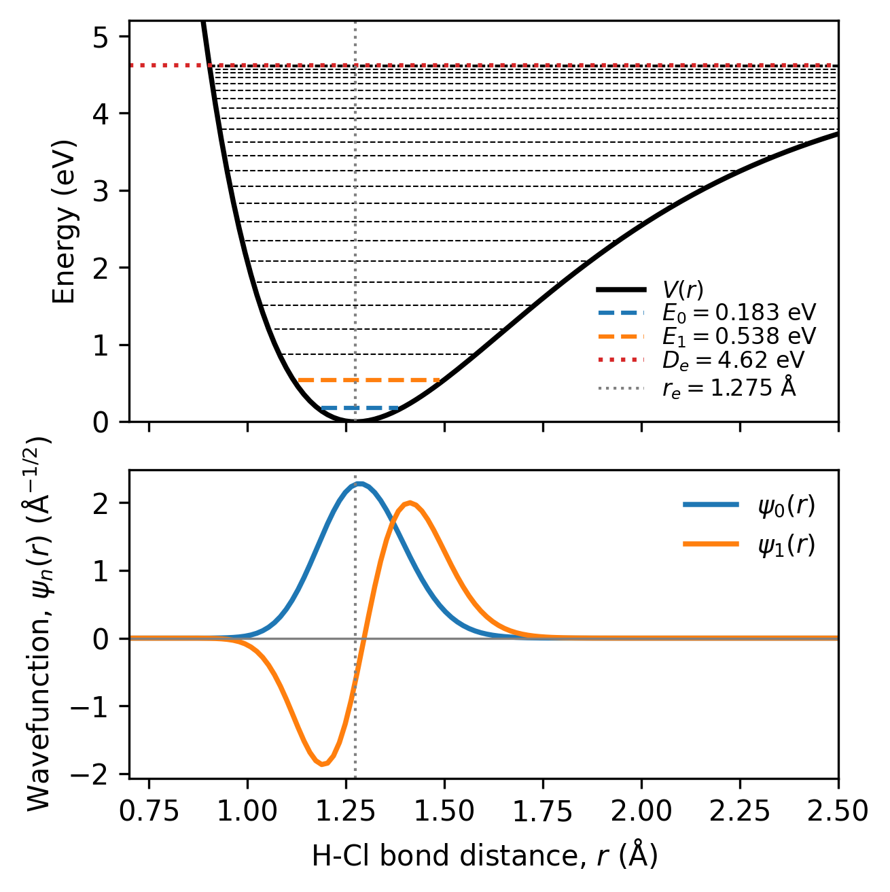

HCl Vibrational States in a Morse Potential
=====================================

This tutorial solves the one-dimensional, time-independent Schrödinger
equation for the vibration of an HCl molecule.  The H--Cl interaction is
represented by a Morse potential, which accounts for anharmonicity and bond
dissociation more realistically than the simple harmonic oscillator.

This tutorial demonstrates how to

#. Construct the Morse potential on a bond-distance grid.
#. Approximate the nuclear kinetic-energy operator using the finite-difference method.
#. Build and diagonalize the Hamiltonian matrix.
#. Extract and normalize the lowest vibrational wavefunctions.
#. Calculate the ``0 -> 1`` transition wavenumber.
#. Plot the potential, energy levels, and wavefunctions.

Physical Model
--------------

The nuclear motion is described by

.. math::

   \hat{H}\psi_n(r)=E_n\psi_n(r),

where

.. math::

   \hat{H}
   =
   -\frac{\hbar^2}{2\mu}\frac{d^2}{dr^2}
   +V(r).

Here, :math:`r` is the H--Cl bond distance and :math:`\mu` is the reduced
mass,

.. math::

   \mu=\frac{m_{\mathrm H}m_{\mathrm{Cl}}}
            {m_{\mathrm H}+m_{\mathrm{Cl}}}.

The Morse potential is

.. math::

   V(r)=D_e\left[1-\exp\left(-a(r-r_e)\right)\right]^2,

where

* :math:`D_e` is the dissociation energy;
* :math:`r_e` is the equilibrium bond distance; and
* :math:`a` controls the width and curvature of the potential.

The parameters used are:

.. list-table::
   :header-rows: 1
   :widths: 35 25 40

   * - Parameter
     - Value
     - Meaning
   * - ``dissociation_energy_eV``
     - :math:`4.43\ \mathrm{eV}`
     - Morse dissociation energy
   * - ``equilibrium_distance``
     - :math:`1.27\ \mathrm{\AA}`
     - Equilibrium H--Cl bond distance
   * - ``morse_a``
     - :math:`1.87\ \mathrm{\AA^{-1}}`
     - Morse range parameter
   * - ``N_grid``
     - 400
     - Number of interior grid points
   * - ``r_min``, ``r_max``
     - :math:`0.50`, :math:`5.00\ \mathrm{\AA}`
     - Bond-distance boundaries

Finite-difference Hamiltonian
-----------------------------

At grid point :math:`r_i`, the second derivative is approximated by

.. math::

   \left.\frac{d^2\psi}{dr^2}\right|_{r_i}
   \approx
   \frac{\psi_{i+1}-2\psi_i+\psi_{i-1}}{(\Delta r)^2}.

Defining

.. math::

   C=\frac{\hbar^2}{2\mu(\Delta r)^2},

the Hamiltonian matrix elements are

.. math::

   H_{ij}=
   \begin{cases}
      2C+V(r_i), & i=j,\\
      -C, & |i-j|=1,\\
      0, & \text{otherwise}.
   \end{cases}

The resulting Hamiltonian is real, symmetric, and tridiagonal.  The two end
points are excluded from the matrix, which imposes the boundary conditions

.. math::

   \psi(r_{\min})=\psi(r_{\max})=0.

Hamiltonian Diagonalization
---------------------------

.. code-block:: text

   eigen_result = eigh(hamiltonian)

The ``eigh`` function is not currently available in the Physika runtime.
Therefore, add the following Python function to ``physika/runtime.py``:

.. code-block:: python

   def eigh(matrix):
       return torch.linalg.eigh(matrix)

It returns the eigenvalues and eigenvectors of the Hamiltonian ordered from lowest to highest:

- the eigenvalues represent the calculated vibrational energies;
- the eigenvectors represent the numerical vibrational wavefunctions.

Wavefunction Normalization
--------------------------

The eigenvectors returned by the matrix solver are normalized as discrete
vectors.  The code rescales them to satisfy the normalization condition

.. math::

   \int |\psi_n(r)|^2\,dr=1.

Transition energies
-------------------

The first vibrational transition energy is

.. math::

   \Delta E_{01}=E_1-E_0,

It is converted to spectroscopic wavenumbers using

.. math::

   \widetilde{\nu}_{nm}
   =
   \frac{\Delta E}{hc}.

Expected Results
----------------
With the parameters and 400-point grid, the results
should be approximately:

.. list-table::
   :header-rows: 1
   :widths: 45 30

   * - Quantity
     - Expected value
   * - Reduced mass
     - :math:`1.6273\times10^{-27}\ \mathrm{kg}`
   * - :math:`E_0`
     - :math:`0.1799\ \mathrm{eV}`
   * - :math:`E_1`
     - :math:`0.5282\ \mathrm{eV}`
   * - :math:`\widetilde{\nu}_{01}`
     - :math:`2809.6\ \mathrm{cm^{-1}}`
   * - Fundamental wavelength
     - :math:`3.559\ \mathrm{\mu m}`
   * - Normalization integrals
     - 1

   **Figure: Morse-potential representation of the HCl molecule.** The upper panel
   shows the potential-energy curve as a function of the H--Cl internuclear
   distance, together with vibrational energy levels,
   equilibrium bond length :math:`r_e`, and dissociation energy :math:`D_e`.
   The lower panel displays the normalized vibrational wavefunctions for the
   ground (:math:`v=0`) and first excited (:math:`v=1`) states.

Creating a Plot
---------------------

The implementation creates the Morse-potential figure by calling the custom
physika_plot function:

.. code-block:: text

        physika_plot(
        bond_distance_angstrom,
        potential_eV,
        psi_0_angstrom,
        psi_1_angstrom,
        vibrational_energies_eV,
        dissociation_energy_eV,
        equilibrium_distance_angstrom,
        25
        )

Here, the final argument specifies the maximum number of vibrational energy
levels to plot. In this example, up to 25 bound levels are requested. Numerical
states with energies greater than or equal to the dissociation energy
:math:`D_e` are automatically excluded.

The ``physika_plot`` function is not currently available in the Physika
runtime. Add the following function to ``physika/runtime.py``:

.. code-block:: python

   def physika_plot(bond_distance,
       potential,
       psi_0,
       psi_1,
       vibrational_energies_eV,
       dissociation_energy,
       equilibrium_distance,
       number_of_levels=10,
   ):
       import numpy as np
       import matplotlib.pyplot as plt

       def to_numpy(value):
           if hasattr(value, "detach"):
               return value.detach().cpu().numpy()
           return np.asarray(value)

       bond_distance = to_numpy(bond_distance).reshape(-1)
       potential = to_numpy(potential).reshape(-1)
       psi_0 = to_numpy(psi_0).reshape(-1)
       psi_1 = to_numpy(psi_1).reshape(-1)
       vibrational_energies_eV = to_numpy(vibrational_energies_eV).reshape(-1)
       dissociation_energy = float(np.asarray(to_numpy(dissociation_energy)).squeeze())
       equilibrium_distance = float(np.asarray(to_numpy(equilibrium_distance)).squeeze())
       bound_energies = vibrational_energies_eV[vibrational_energies_eV < dissociation_energy]
       number_of_levels = min(int(number_of_levels), len(bound_energies),)
       fig, (ax_energy, ax_wavefunction) = plt.subplots(
           2,
           1,
           figsize=(4.5, 4.5),
           sharex=True,
           gridspec_kw={"height_ratios": [1.3, 1.0]},
       )

       # Upper panel: Morse potential and vibrational energies
       ax_energy.plot(bond_distance, potential, color="black", linewidth=1.8, label=r"$V(r)$")
       for n in range(number_of_levels):
           energy = float(bound_energies[n])
           mask = potential <= energy
           if n == 0:
               color = "tab:blue"
               linewidth = 1.5
               label = rf"$E_0={energy:.3f}\ \mathrm{{eV}}$"
           elif n == 1:
               color = "tab:orange"
               linewidth = 1.5
               label = rf"$E_1={energy:.3f}\ \mathrm{{eV}}$"
           else:
               color = "black"
               linewidth = 0.5
               label = "_nolegend_"
           ax_energy.plot(
               bond_distance[mask],
               np.full_like(bond_distance[mask], energy, dtype=float),
               color=color,
               linestyle="--",
               linewidth=linewidth,
               label=label,
           )
       ax_energy.axhline(
           dissociation_energy,
           color="tab:red",
           linestyle=":",
           linewidth=1.5,
           label=rf"$D_e={dissociation_energy:.2f}\ "
                 rf"\mathrm{{eV}}$",
       )
       ax_energy.axvline(
           equilibrium_distance,
           color="gray",
           linestyle=":",
           linewidth=1.0,
           label=rf"$r_e={equilibrium_distance:.3f}\ "
                 rf"\mathrm{{\AA}}$",
       )
       ax_energy.set_ylabel("Energy (eV)")
       ax_energy.set_ylim(0.0, max(5.2, 1.05 * dissociation_energy))
       ax_energy.legend(frameon=False, fontsize=8, loc="lower right", labelspacing=0)

       # Lower panel: normalized vibrational wavefunctions
       ax_wavefunction.plot(
           bond_distance,
           psi_0,
           color="tab:blue",
           linewidth=1.8,
           label=r"$\psi_0(r)$",
       )
       ax_wavefunction.plot(
           bond_distance,
           psi_1,
           color="tab:orange",
           linewidth=1.8,
           label=r"$\psi_1(r)$",
       )
       ax_wavefunction.axhline(0.0, color="gray", linewidth=0.8)
       ax_wavefunction.axvline(equilibrium_distance, color="gray", linestyle=":", linewidth=1.0)
       ax_wavefunction.set_xlabel(r"H-Cl bond distance, $r$ ($\mathrm{\AA}$)")
       ax_wavefunction.set_ylabel(r"Wavefunction, $\psi_n(r)$ " r"($\mathrm{\AA}^{-1/2}$)")
       ax_wavefunction.legend(frameon=False, fontsize=9)
       ax_wavefunction.set_xlim(0.7, 2.5)
       plt.tight_layout()
       plt.show()
       plt.close()

Source File
-----------

The complete Physika implementation is provided in
``physika/tutorials/HCl_morse_oscillator.phyk``.  It requires the symmetric-matrix operation
``eigh``, mapped by the runtime to an appropriate numerical eigensolver.

