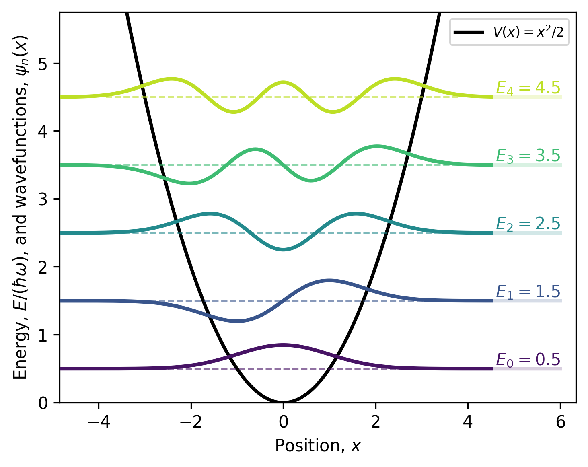

Learning the Parameters and Evaluating the Quantum Harmonic Oscillator
======================================================================

Overview
--------

This tutorial models a one-dimensional quantum simple harmonic
oscillator (SHO). It learns the characteristic energy spacing
:math:`\hbar\omega` from reference vibrational energy levels and uses
the learned parameter to construct the harmonic potential,
wavefunctions, and Hamiltonian. Carbon monoxide (CO) serves as the
physical example, providing the reference vibrational energy levels
and reduced mass used to learn and construct the SHO model.

The tutorial is divided into two parts:

1. **Parameter learning:** Learn :math:`\hbar\omega` by minimizing the mean
   squared error between the model and reference energies.
2. **Evaluating the harmonic oscillator:** Use the learned parameter to
   construct the analytical wavefunctions and evaluate their energies using
   the finite-difference Hamiltonian.

.. admonition:: Problem statement

   Model the CO bond vibration as a 1D quantum harmonic oscillator, learn its
   energy spacing from reference vibrational energies, construct the corresponding
   analytical wavefunctions, and verify their energies by numerically applying the
   Hamiltonian.

   .. math::

      \hat H\psi_n(x)=E_n\psi_n(x).

Physical model
--------------

The harmonic potential for a molecular vibration is

.. math::

   V(x)=\frac{1}{2}\mu\omega^2x^2,

where

* :math:`x` is the displacement from the equilibrium position,
* :math:`\mu` is the reduced mass, and
* :math:`\omega` is the angular frequency.

The reduced mass of CO is

.. math::

   \mu=\frac{m_{\mathrm C}m_{\mathrm O}}{m_{\mathrm C}+m_{\mathrm O}}.

.. code-block:: python

   # Physical constants
   hbar_SI: ℝ = 1.054571817e-34
   joule_per_electronvolt: ℝ = 1.602176634e-19
   atomic_mass_unit: ℝ = 1.66053906660e-27
   pi: ℝ = 3.141592653589793
   meter_to_angstrom: ℝ = 1.0e10

   # CO reduced mass
   carbon_mass_amu: ℝ = 12.0
   oxygen_mass_amu: ℝ = 15.99491461957
   reduced_mass_amu: ℝ = carbon_mass_amu * oxygen_mass_amu / (carbon_mass_amu + oxygen_mass_amu)
   reduced_mass: ℝ = reduced_mass_amu * atomic_mass_unit

For a quantum harmonic oscillator, the exact energies are

.. math::

   E_n=\left(n+\frac{1}{2}\right)\hbar\omega,
   \qquad n=0,1,2,\ldots

Therefore, the difference between consecutive energy levels is the constant

.. math::

   E_{n+1}-E_n=\hbar\omega.

Part 1: Learning the energy spacing
-----------------------------------

1.1 Reference energies
~~~~~~~~~~~~~~~~~~~~~~

The training data contain ideal harmonic-oscillator energies constructed
from a reference CO vibrational spacing.

.. code-block:: python

   # CO reference energies in eV
   N_levels: ℕ = 5
   reference_energies_eV: ℝ[N_levels] = [0.134509, 0.403527, 0.672545, 0.941563, 1.210581]

1.2 Model energies
~~~~~~~~~~~~~~~~~~

For a trial energy spacing :math:`\Delta E`, the model predicts

.. math::

   E_n^{\mathrm{model}}=\left(n+\frac{1}{2}\right)\Delta E,

where the trainable parameter is

.. math::

   \Delta E=\hbar\omega.

The function below evaluates this equation for every state.

.. code-block:: python

   # Calculate harmonic energies using the trial energy spacing hbar*omega
   def calculate_model_energies_eV(energy_spacing_eV: ℝ): ℝ[m]:
       model_energies_eV: ℝ[N_levels] = for n: ℕ(N_levels) -> n * 0.0
       for n: ℕ(N_levels):
           model_energies_eV[n] = energy_spacing_eV * (n * 1.0 + 0.5)
       return model_energies_eV

1.3 Training loss
~~~~~~~~~~~~~~~~~

The trainable spacing is found by minimizing the mean squared error (MSE)
between the model and reference energies:

.. math::

   \mathcal L(\Delta E)=\frac{1}{N_{\mathrm{levels}}}
   \sum_{n=0}^{N_{\mathrm{levels}}-1}
   \left[E_n^{\mathrm{model}}(\Delta E)-E_n^{\mathrm{reference}}\right]^2.

For each state, the code calculates the energy error.

.. code-block:: python

   # Calculate mean squared error in eV^2
   def calculate_energy_spacing_loss(energy_spacing_eV: ℝ): ℝ:
       model_energies_eV: ℝ[N_levels] = calculate_model_energies_eV(energy_spacing_eV)
       total_loss: ℝ = 0.0
       energy_error_eV: ℝ = 0.0
       for n: ℕ(N_levels):
           energy_error_eV = model_energies_eV[n] - reference_energies_eV[n]
           total_loss = total_loss + energy_error_eV**2
       return total_loss / (N_levels * 1.0)

1.4 Adam optimizer
~~~~~~~~~~~~~~~~~~

Adam uses the gradient of the loss together with moving averages of the
gradient and squared gradient. Bias correction compensates for initializing
both moving averages at zero, and ``epsilon`` prevents division by zero. The
function returns the updated parameter, both updated moments, and the next
optimization step.

.. code-block:: python

   # Adam optimizer
   def adam(parameter: ℝ, gradient_value: ℝ, first_moment: ℝ, second_moment: ℝ, step: ℝ, learning_rate: ℝ): ℝ[4]:
       beta_1: ℝ = 0.9
       beta_2: ℝ = 0.999
       epsilon: ℝ = 1.0e-6
       new_first_moment: ℝ = beta_1 * first_moment + (1.0 - beta_1) * gradient_value
       new_second_moment: ℝ = beta_2 * second_moment + (1.0 - beta_2) * gradient_value**2
       corrected_first_moment: ℝ = new_first_moment / (1.0 - beta_1**step)
       corrected_second_moment: ℝ = new_second_moment / (1.0 - beta_2**step)
       new_parameter: ℝ = parameter - learning_rate * corrected_first_moment / (sqrt(corrected_second_moment) + epsilon)
       return [new_parameter, new_first_moment, new_second_moment, step + 1.0]

1.5 Learning loop
~~~~~~~~~~~~~~~~~

The energy spacing starts at ``0.0`` eV. At every epoch, Physika's ``grad``
operation evaluates :math:`\partial\mathcal L/\partial(\Delta E)`, Adam uses
that gradient to update the spacing, and the optimizer state is retained for
the next epoch.

.. code-block:: python

   # Learn the energy spacing hbar*omega in eV
   learned_energy_spacing_eV: ℝ = 0.0
   first_moment: ℝ = 0.0
   second_moment: ℝ = 0.0
   optimizer_step: ℝ = 1.0
   learning_rate: ℝ = 0.01
   epochs: ℕ = 100
   energy_spacing_gradient: ℝ = 0.0
   adam_result: ℝ[4] = [learned_energy_spacing_eV, first_moment, second_moment, optimizer_step]

   for epoch: ℕ(epochs):
       energy_spacing_gradient = grad(calculate_energy_spacing_loss, learned_energy_spacing_eV)
       adam_result = adam(learned_energy_spacing_eV, energy_spacing_gradient, first_moment, second_moment, optimizer_step, learning_rate)
       learned_energy_spacing_eV = adam_result[0]
       first_moment = adam_result[1]
       second_moment = adam_result[2]
       optimizer_step = adam_result[3]

.. figure:: ../_static/tutorial_files/quantum_SHO_loss.png
   :align: center
   :width: 70%
   :alt: Training loss

   **Figure 1.** Mean squared error between the predicted and reference
   harmonic-oscillator energy levels as a function of the training epoch.
   The rapid decrease in loss shows that the model progressively learns the
   energy spacing from the CO reference data. By the final epoch, the small
   loss indicates that the optimization has converged.

1.6 Learned physical parameters
~~~~~~~~~~~~~~~~~~~~~~~~~~~~~~~

The learned energy spacing is :math:`\hbar\omega` in eV. Multiplying it by the
joule-per-electronvolt conversion factor and dividing by :math:`\hbar` gives
the angular frequency:

.. math::

   \omega=\frac{(\hbar\omega)_{\mathrm{eV}}
   C_{\mathrm{eV\rightarrow J}}}{\hbar}.

The corresponding force constant is

.. math::

   k=\mu\omega^2.

.. code-block:: python

   # Calculate learned physical parameters
   learned_angular_frequency: ℝ = learned_energy_spacing_eV * joule_per_electronvolt / hbar_SI
   learned_force_constant: ℝ = reduced_mass * (learned_angular_frequency**2)

Part 2: Constructing the Wavefunctions and Evaluating the Hamiltonian
---------------------------------------------------------------------

Part 2 uses the learned angular frequency to construct analytical
harmonic-oscillator states and verify their energies by applying the
time-independent Schrödinger Hamiltonian numerically.

.. math::

   \left[-\frac{\hbar^2}{2\mu}\frac{d^2}{dx^2}
   +\frac{1}{2}\mu\omega^2x^2\right]\psi_n(x)=E_n\psi_n(x).

2.1 Oscillator length and physical grid
~~~~~~~~~~~~~~~~~~~~~~~~~~~~~~~~~~~~~~~

The oscillator length

.. math::

   l_{\mathrm{osc}}=\sqrt{\frac{\hbar}{\mu\omega}}

is the characteristic width scale of the oscillator. It is used here only to
set a sufficiently wide length domain.

The interval :math:`[-10l_{\mathrm{osc}},10l_{\mathrm{osc}}]` is divided into
600 equal intervals using 601 grid points. ``position_m`` is used in the
derivatives, wavefunctions, potential, and integrals.

.. code-block:: python

   # Calculate oscillator length
   oscillator_length_m: ℝ = sqrt(hbar_SI / (reduced_mass * learned_angular_frequency))

   # Numerical grid in the physical displacement x (metres)
   x_max_m: ℝ = 10.0 * oscillator_length_m
   N_grid: ℕ = 601
   dx_m: ℝ = 2.0 * x_max_m / ((N_grid - 1) * 1.0)
   position_m: ℝ[N_grid] = for i: ℕ(N_grid) -> -x_max_m + i * dx_m
   position_A: ℝ[N_grid] = for i: ℕ(N_grid) -> position_m[i] * meter_to_angstrom

2.2 Analytical wavefunctions
~~~~~~~~~~~~~~~~~~~~~~~~~~~~

The normalized ground-state wavefunction is

.. math::

   \psi_0(x)=\left(\frac{\mu\omega}{\pi\hbar}\right)^{1/4}
   \exp\left(-\frac{\mu\omega x^2}{2\hbar}\right).

The normalization constant ensures that the total probability of finding the particle is one:

.. math::

   \int_{-\infty}^{+\infty}|\psi_0(x)|^2\,dx=1.

Although the analytical normalization is defined over the entire real line,
the numerical domain extends to :math:`\pm10l_{\mathrm{osc}}`.

.. code-block:: python

   # Initialize wavefunction
   wavefunctions: ℝ[N_levels,N_grid] = for n: ℕ(N_levels) -> for i: ℕ(N_grid) -> (n + i) * 0.0

   # Construct normalized harmonic-oscillator wavefunctions psi_n(x)
   mass_frequency_over_hbar: ℝ = reduced_mass * learned_angular_frequency / hbar_SI
   normalization_constant: ℝ = (mass_frequency_over_hbar / pi)**0.25

   for i: ℕ(N_grid):
       wavefunctions[0,i] = normalization_constant * exp(-0.5 * mass_frequency_over_hbar * position_m[i]**2)

The first excited state is obtained by applying the harmonic-oscillator
raising operator to the ground state:

.. math::

   \psi_1(x)=\hat a^\dagger\psi_0(x),

where

.. math::

   \hat a^\dagger
   =
   \sqrt{\frac{\mu\omega}{2\hbar}}\,x
   -
   \sqrt{\frac{\hbar}{2\mu\omega}}
   \frac{d}{dx}.

.. math::

   \psi_1(x)
   =
   \sqrt{\frac{2\mu\omega}{\hbar}}
   x\psi_0(x).

The level check prevents access to a second row when only one level is
requested.

.. code-block:: python

   one_level: ℕ = 1
   if N_levels > one_level:
       for i: ℕ(N_grid):
           wavefunctions[1,i] = sqrt(2.0 * mass_frequency_over_hbar) * position_m[i] * wavefunctions[0,i]

The higher states are generated recursively using the recurrence relation of the
Hermite polynomials:

.. math::

   \psi_{n+1}(x)=\sqrt{\frac{2}{n+1}}
   \sqrt{\frac{\mu\omega}{\hbar}}x\psi_n(x)
   -\sqrt{\frac{n}{n+1}}\psi_{n-1}(x).

``n_real`` and ``next_n_real`` allow the square-root coefficients to be
evaluated as real numbers. Starting with :math:`\psi_0` and :math:`\psi_1`,
each pass through the loop constructs the next state from the preceding two.

.. code-block:: python

   two_levels: ℕ = 2
   n_real: ℝ = 0.0
   next_n_real: ℝ = 0.0
   first_coefficient: ℝ = 0.0
   second_coefficient: ℝ = 0.0

   if N_levels > two_levels:
       for n: ℕ(1, N_levels - 1):
           n_real = n * 1.0
           next_n_real = n_real + 1.0
           first_coefficient = sqrt(2.0 / next_n_real)
           second_coefficient = sqrt(n_real / next_n_real)
           for i: ℕ(N_grid):
               wavefunctions[n + 1,i] = first_coefficient * sqrt(mass_frequency_over_hbar) * position_m[i] * wavefunctions[n,i] - second_coefficient * wavefunctions[n - 1,i]

2.3 Applying the Hamiltonian
~~~~~~~~~~~~~~~~~~~~~~~~~~~~

The kinetic term requires the second derivative, which is approximated at each
interior grid point using the central finite-difference formula

.. math::

   \left.\frac{d^2\psi_n}{dx^2}\right|_{x_i}\approx
   \frac{\psi_n(x_{i+1})-2\psi_n(x_i)+\psi_n(x_{i-1})}{(\Delta x)^2}.

At each grid point, the harmonic potential is evaluated using Eq. (2). The full Hamiltonian
is then applied as

.. math::

   \hat H\psi_n=-\frac{\hbar^2}{2\mu}\frac{d^2\psi_n}{dx^2}
   +V(x)\psi_n.

Only interior indices are used because the central difference requires one
neighbor on each side. The kinetic and potential terms are calculated in
joules and their sum is converted to eV.

.. code-block:: python

   # Full Hamiltonian
   kinetic_coefficient_J_m2: ℝ = hbar_SI**2 / (2.0 * reduced_mass)
   second_derivative: ℝ = 0.0
   hamiltonian_wavefunctions: ℝ[N_levels,N_grid] = for n: ℕ(N_levels) -> for i: ℕ(N_grid) -> (n + i) * 0.0
   kinetic_part_J: ℝ = 0.0
   potential_part_J: ℝ = 0.0
   potential_J: ℝ[N_grid] = for i: ℕ(N_grid) -> 0.5 * reduced_mass * learned_angular_frequency**2 * position_m[i]**2
   potential_eV: ℝ[N_grid] = for i: ℕ(N_grid) -> potential_J[i] / joule_per_electronvolt

   # Apply both the kinetic and potential parts of the Hamiltonian
   for n: ℕ(N_levels):
       for i: ℕ(1, N_grid - 1):
           second_derivative = (wavefunctions[n,i + 1] - 2.0 * wavefunctions[n,i] + wavefunctions[n,i - 1]) / (dx_m * dx_m)
           kinetic_part_J = -kinetic_coefficient_J_m2 * second_derivative
           potential_part_J = potential_J[i] * wavefunctions[n,i]
           hamiltonian_wavefunctions[n,i] = (kinetic_part_J + potential_part_J) / joule_per_electronvolt

2.4 Energy expectation values
~~~~~~~~~~~~~~~~~~~~~~~~~~~~~~~~~~~~~~~~

The numerical energy of each state is calculated from

.. math::

   E_n^{\mathrm{numerical}}=
   \frac{\int\psi_n(x)\hat H\psi_n(x)\,dx}
   {\int|\psi_n(x)|^2\,dx}.

The integrals are approximated by sums with grid spacing ``dx_m``. Dividing by
the numerical normalization integral corrects for small finite-grid and
truncation errors.

.. code-block:: python

   # Calculate energy expectation values
   energy_numerator: ℝ = 0.0
   normalization_integral: ℝ = 0.0
   numerical_energies_eV: ℝ[N_levels] = for n: ℕ(N_levels) -> n * 0.0

   for n: ℕ(N_levels):
       energy_numerator = 0.0
       normalization_integral = 0.0
       for i: ℕ(1, N_grid - 1):
           energy_numerator = energy_numerator + wavefunctions[n,i] * hamiltonian_wavefunctions[n,i] * dx_m
           normalization_integral = normalization_integral + wavefunctions[n,i] * wavefunctions[n,i] * dx_m
       numerical_energies_eV[n] = energy_numerator / normalization_integral

2.5 Output
~~~~~~~~~~

The code prints the learned energy spacing, angular frequency, and force
constant. The learned energy spacing is :math:`0.26825\ \mathrm{eV}`,
corresponding to an angular frequency of
:math:`4.0754\times10^{14}\ \mathrm{rad\,s^{-1}}`. Using the CO reduced
mass, the learned force constant is
:math:`1.8909\times10^{3}\ \mathrm{N\,m^{-1}}`.

.. code-block:: python

   # Print results
   physika_print(learned_energy_spacing_eV)
   physika_print(learned_angular_frequency)
   physika_print(learned_force_constant)

.. admonition:: Expected results

   | ✓ No type errors found
   | 0.26824676990509033 ∈ ℝ
   | 407538575081472.0 ∈ ℝ
   | 1890.90869140625 ∈ ℝ

   **Figure 2.** The calculated harmonic-oscillator energies and wavefunctions.

The black parabola represents the harmonic potential. The colored horizontal
lines show the calculated energy levels, while the colored curves show the
wavefunctions shifted to their corresponding energies. The wavefunctions
alternate between even and odd parity, and each state :math:`\psi_n` has exactly
:math:`n` nodes.

2.6 Plotting (optional)
~~~~~~~~~~~~~~~~~~~~~~~

.. code-block:: python

   # Plotting (optional)
   physika_plot(position_A, wavefunctions, numerical_energies_eV, N_levels, potential_eV)

The plotting call passes the position grid, wavefunctions, calculated energies,
number of levels, and potential to the plotting helper. Add the custom
``physika_plot`` helper to ``runtime.py`` to plot the results.

.. code-block:: python

   def physika_plot(position: object, wavefunctions: object, energies: object, N_levels: object, potential: object) -> None:
       import matplotlib.pyplot as plt
       import numpy as np
       import torch
       # Convert tensors or arrays to NumPy.
       x = position.detach().cpu().numpy() if isinstance(position, torch.Tensor) else np.asarray(position)
       psi = wavefunctions.detach().cpu().numpy() if isinstance(wavefunctions, torch.Tensor) else np.asarray(wavefunctions)
       energy_values = energies.detach().cpu().numpy() if isinstance(energies, torch.Tensor) else np.asarray(energies)
       potential_values = potential.detach().cpu().numpy() if isinstance(potential, torch.Tensor) else np.asarray(potential)
       number_of_levels = int(N_levels.detach().cpu().item()) if isinstance(N_levels, torch.Tensor) else int(N_levels)
       x = np.asarray(x, dtype=float).reshape(-1)
       psi = np.asarray(psi, dtype=float)
       energy_values = np.asarray(energy_values, dtype=float).reshape(-1)
       potential_values = np.asarray(potential_values, dtype=float).reshape(-1)
       psi = psi[:number_of_levels]
       energy_values = energy_values[:number_of_levels]
       if number_of_levels > 1:
           positive_differences = np.diff(np.sort(energy_values))
           positive_differences = positive_differences[positive_differences > 0.0]
           energy_spacing = float(np.min(positive_differences)) if positive_differences.size else 1.0
       else:
           energy_spacing = max(1.0, abs(float(energy_values[0])))
       maximum_wavefunction = float(np.max(np.abs(psi)))
       wavefunction_scale = 0.35 * energy_spacing / maximum_wavefunction if maximum_wavefunction > 0.0 else 1.0
       maximum_energy = float(np.max(energy_values))
       minimum_energy = float(np.min(energy_values))
       maximum_displayed_energy = maximum_energy + 0.75 * energy_spacing
       minimum_displayed_energy = min(0.0, minimum_energy - 0.50 * energy_spacing)
       visible_indices = np.where(potential_values <= maximum_displayed_energy)[0]
       if visible_indices.size:
           padding = max(2, int(0.05 * x.size))
           first_visible = max(0, int(visible_indices[0]) - padding)
           last_visible = min(x.size - 1, int(visible_indices[-1]) + padding)
           x_min, x_max = float(x[first_visible]), float(x[last_visible])
       else:
           x_min, x_max = float(np.min(x)), float(np.max(x))
       fig, ax = plt.subplots(figsize=(5, 4))
       colors = plt.cm.viridis(np.linspace(0.05, 0.90, number_of_levels))
       ax.plot(x, potential_values, color="black", linewidth=2.0, label=r"$V(x)=\frac{1}{2}\mu\omega^2x^2$", zorder=1)
       for level in range(number_of_levels):
           energy = float(energy_values[level])
           color = colors[level]
           ax.hlines(energy, x_min, x_max, color=color, linewidth=1.0, linestyle="--", alpha=0.60, zorder=2)
           ax.plot(x, energy + wavefunction_scale * psi[level], color=color, linewidth=2.2, zorder=3)
           ax.text(0.97, energy, rf"$E_{{{level}}}={energy:.3f} eV$", transform=ax.get_yaxis_transform(), ha="right", va="bottom", color=color, fontsize=10, bbox={"facecolor": "white", "edgecolor": "none", "alpha": 0.80, "pad": 1.5}, zorder=4)
       ax.set_xlim(x_min - 0.03, x_max + 0.2)
       ax.set_ylim(minimum_displayed_energy, maximum_displayed_energy + 0.1)
       ax.set_xlabel(r"Position, $x$ ($\AA$)", fontsize=10)
       ax.set_ylabel(r"Energy (eV), and wavefunctions, $\psi_n(x)$", fontsize=10)
       ax.legend(loc="upper right", frameon=True, fontsize=8)
       fig.tight_layout()
       plt.show()
       plt.close(fig)

Source code
-----------

The complete Physika implementation is provided in
``tutorials/learn_parameter_quantum_SHO.phyk``.

.. code-block:: python

   # Physical constants
   hbar_SI: ℝ = 1.054571817e-34
   joule_per_electronvolt: ℝ = 1.602176634e-19
   atomic_mass_unit: ℝ = 1.66053906660e-27
   pi: ℝ = 3.141592653589793
   meter_to_angstrom: ℝ = 1.0e10

   # CO reduced mass
   carbon_mass_amu: ℝ = 12.0
   oxygen_mass_amu: ℝ = 15.99491461957
   reduced_mass_amu: ℝ = carbon_mass_amu * oxygen_mass_amu / (carbon_mass_amu + oxygen_mass_amu)
   reduced_mass: ℝ = reduced_mass_amu * atomic_mass_unit

   # CO reference energies in eV
   N_levels: ℕ = 5
   reference_energies_eV: ℝ[N_levels] = [0.134509, 0.403527, 0.672545, 0.941563, 1.210581]

   # Calculate harmonic energies using the trial energy spacing hbar*omega
   def calculate_model_energies_eV(energy_spacing_eV: ℝ): ℝ[m]:
       model_energies_eV: ℝ[N_levels] = for n: ℕ(N_levels) -> n * 0.0
       for n: ℕ(N_levels):
           model_energies_eV[n] = energy_spacing_eV * (n * 1.0 + 0.5)
       return model_energies_eV

   # Calculate mean squared error in eV^2
   def calculate_energy_spacing_loss(energy_spacing_eV: ℝ): ℝ:
       model_energies_eV: ℝ[N_levels] = calculate_model_energies_eV(energy_spacing_eV)
       total_loss: ℝ = 0.0
       energy_error_eV: ℝ = 0.0
       for n: ℕ(N_levels):
           energy_error_eV = model_energies_eV[n] - reference_energies_eV[n]
           total_loss = total_loss + energy_error_eV**2
       return total_loss / (N_levels * 1.0)

   # Adam optimizer
   def adam(parameter: ℝ, gradient_value: ℝ, first_moment: ℝ, second_moment: ℝ, step: ℝ, learning_rate: ℝ): ℝ[4]:
       beta_1: ℝ = 0.9
       beta_2: ℝ = 0.999
       epsilon: ℝ = 1.0e-6
       new_first_moment: ℝ = beta_1 * first_moment + (1.0 - beta_1) * gradient_value
       new_second_moment: ℝ = beta_2 * second_moment + (1.0 - beta_2) * gradient_value**2
       corrected_first_moment: ℝ = new_first_moment / (1.0 - beta_1**step)
       corrected_second_moment: ℝ = new_second_moment / (1.0 - beta_2**step)
       new_parameter: ℝ = parameter - learning_rate * corrected_first_moment / (sqrt(corrected_second_moment) + epsilon)
       return [new_parameter, new_first_moment, new_second_moment, step + 1.0]

   # Learn the energy spacing hbar*omega in eV
   learned_energy_spacing_eV: ℝ = 0.0
   first_moment: ℝ = 0.0
   second_moment: ℝ = 0.0
   optimizer_step: ℝ = 1.0
   learning_rate: ℝ = 0.01
   epochs: ℕ = 100
   energy_spacing_gradient: ℝ = 0.0
   adam_result: ℝ[4] = [learned_energy_spacing_eV, first_moment, second_moment, optimizer_step]

   for epoch: ℕ(epochs):
       energy_spacing_gradient = grad(calculate_energy_spacing_loss, learned_energy_spacing_eV)
       adam_result = adam(learned_energy_spacing_eV, energy_spacing_gradient, first_moment, second_moment, optimizer_step, learning_rate)
       learned_energy_spacing_eV = adam_result[0]
       first_moment = adam_result[1]
       second_moment = adam_result[2]
       optimizer_step = adam_result[3]

   # Calculate learned physical parameters
   learned_angular_frequency: ℝ = learned_energy_spacing_eV * joule_per_electronvolt / hbar_SI
   learned_force_constant: ℝ = reduced_mass * (learned_angular_frequency**2)

   # Calculate oscillator length
   oscillator_length_m: ℝ = sqrt(hbar_SI / (reduced_mass * learned_angular_frequency))

   # Numerical grid in the physical displacement x (metres)
   x_max_m: ℝ = 10.0 * oscillator_length_m
   N_grid: ℕ = 601
   dx_m: ℝ = 2.0 * x_max_m / ((N_grid - 1) * 1.0)
   position_m: ℝ[N_grid] = for i: ℕ(N_grid) -> -x_max_m + i * dx_m
   position_A: ℝ[N_grid] = for i: ℕ(N_grid) -> position_m[i] * meter_to_angstrom

   # Initialize wavefunction
   wavefunctions: ℝ[N_levels,N_grid] = for n: ℕ(N_levels) -> for i: ℕ(N_grid) -> (n + i) * 0.0

   # Construct normalized harmonic-oscillator wavefunctions psi_n(x)
   mass_frequency_over_hbar: ℝ = reduced_mass * learned_angular_frequency / hbar_SI
   normalization_constant: ℝ = (mass_frequency_over_hbar / pi)**0.25

   for i: ℕ(N_grid):
       wavefunctions[0,i] = normalization_constant * exp(-0.5 * mass_frequency_over_hbar * position_m[i]**2)

   one_level: ℕ = 1
   if N_levels > one_level:
       for i: ℕ(N_grid):
           wavefunctions[1,i] = sqrt(2.0 * mass_frequency_over_hbar) * position_m[i] * wavefunctions[0,i]

   two_levels: ℕ = 2
   n_real: ℝ = 0.0
   next_n_real: ℝ = 0.0
   first_coefficient: ℝ = 0.0
   second_coefficient: ℝ = 0.0

   if N_levels > two_levels:
       for n: ℕ(1, N_levels - 1):
           n_real = n * 1.0
           next_n_real = n_real + 1.0
           first_coefficient = sqrt(2.0 / next_n_real)
           second_coefficient = sqrt(n_real / next_n_real)
           for i: ℕ(N_grid):
               wavefunctions[n + 1,i] = first_coefficient * sqrt(mass_frequency_over_hbar) * position_m[i] * wavefunctions[n,i] - second_coefficient * wavefunctions[n - 1,i]

   # Full Hamiltonian
   kinetic_coefficient_J_m2: ℝ = hbar_SI**2 / (2.0 * reduced_mass)
   second_derivative: ℝ = 0.0
   hamiltonian_wavefunctions: ℝ[N_levels,N_grid] = for n: ℕ(N_levels) -> for i: ℕ(N_grid) -> (n + i) * 0.0
   kinetic_part_J: ℝ = 0.0
   potential_part_J: ℝ = 0.0
   potential_J: ℝ[N_grid] = for i: ℕ(N_grid) -> 0.5 * reduced_mass * learned_angular_frequency**2 * position_m[i]**2
   potential_eV: ℝ[N_grid] = for i: ℕ(N_grid) -> potential_J[i] / joule_per_electronvolt

   # Apply both the kinetic and potential parts of the Hamiltonian
   for n: ℕ(N_levels):
       for i: ℕ(1, N_grid - 1):
           second_derivative = (wavefunctions[n,i + 1] - 2.0 * wavefunctions[n,i] + wavefunctions[n,i - 1]) / (dx_m * dx_m)
           kinetic_part_J = -kinetic_coefficient_J_m2 * second_derivative
           potential_part_J = potential_J[i] * wavefunctions[n,i]
           hamiltonian_wavefunctions[n,i] = (kinetic_part_J + potential_part_J) / joule_per_electronvolt

   # Calculate energy expectation values
   energy_numerator: ℝ = 0.0
   normalization_integral: ℝ = 0.0
   numerical_energies_eV: ℝ[N_levels] = for n: ℕ(N_levels) -> n * 0.0

   for n: ℕ(N_levels):
       energy_numerator = 0.0
       normalization_integral = 0.0
       for i: ℕ(1, N_grid - 1):
           energy_numerator = energy_numerator + wavefunctions[n,i] * hamiltonian_wavefunctions[n,i] * dx_m
           normalization_integral = normalization_integral + wavefunctions[n,i] * wavefunctions[n,i] * dx_m
       numerical_energies_eV[n] = energy_numerator / normalization_integral

   # Print results
   physika_print(learned_energy_spacing_eV)
   physika_print(learned_angular_frequency)
   physika_print(learned_force_constant)

   # Use the function below to plot the wavefunctions and energies
   #physika_plot(position_A, wavefunctions, numerical_energies_eV, N_levels, potential_eV)

References
----------

#. D. J. Griffiths and D. F. Schroeter, *Introduction to Quantum
   Mechanics*, 3rd ed., Cambridge University Press, 2018.

#. K. P. Huber and G. Herzberg, *Molecular Spectra and Molecular
   Structure IV: Constants of Diatomic Molecules*, Van Nostrand
   Reinhold, New York, 1979. Spectroscopic data are available through
   the `NIST Chemistry WebBook <https://webbook.nist.gov/cgi/cbook.cgi?ID=C630080&Mask=1000>`_.

#. D. P. Kingma and J. Ba, "Adam: A Method for Stochastic
   Optimization," *International Conference on Learning
   Representations* (ICLR), 2015.
   `arXiv:1412.6980 <https://arxiv.org/abs/1412.6980>`_.
