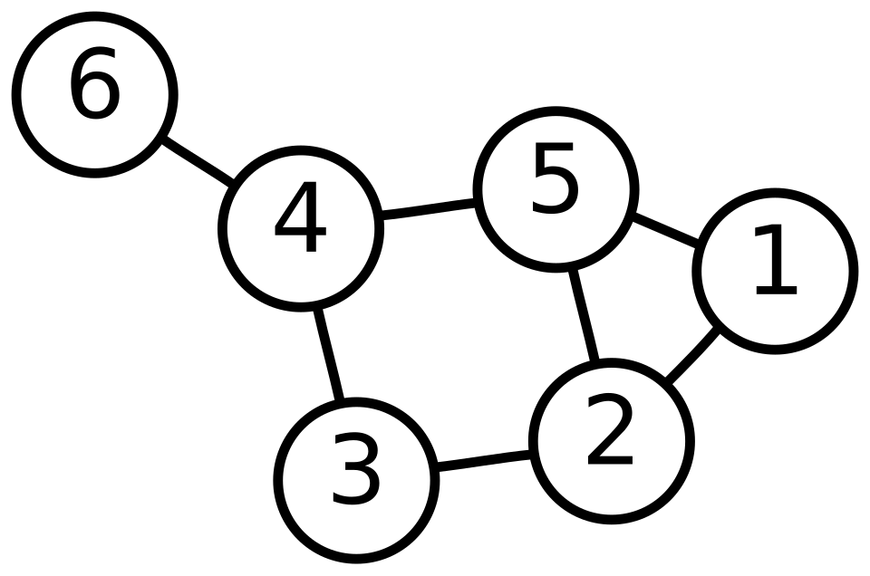

Undirected Graph class
======================

This tutorial implements an undirected graph, the ``UndirectedGraph`` class
familiar from a dict-of-adjacency-lists implementation, in Physika.

   Figure 1: A graph with six vertices and seven edges [AzaTothGraph]_

Graphs provide a powerful way to represent relationships and connections
between different entities like people in a social network, computers in a
datacenter, etc. Graph algorithms can then be used to solve problems such as
finding shortest path between locations, determining connectivity.

The exact origin of graphs as a general mathematical concept is difficult to
attribute to a single person, but the origin of graph theory is can traced to
Leonhard Euler's work on the Seven Bridges of Königsberg in 1736. [Euler1736]_

Design
------

Physika has no ``dictionary`` and no growable container, and its values are
immutable, so the design differs from the Python in three ways:

- The adjacency structure is a fixed-size matrix, ``adjacency: ℝ[n, n]``,
  holding the edge weight at ``[u, v]`` wherever an edge connects ``u`` and
  ``v`` (``1.0`` for a plain unweighted edge);
- A method that would mutate the graph instead returns a **new** ``Graph``;
- Adding a vertex changes the matrix shape, which a method cannot do to its
  own ``this`` in place, so the new vertex count is passed in explicitly as
  a ``ℕ`` parameter.

Because the adjacency entries are real numbers, any readout built from them
with ``+``, ``*`` and ``sum`` is **differentiable** in the edge weights --
see :ref:`undirected-graph-differentiability` below.

The UndirectedGraph class
-------------------------

.. code-block:: text

    class UndirectedGraph():
        adjacency: ℝ[n, n]
        def num_vertices() → ℝ:
            return get_2d_array_num_rows(this.adjacency) * 1.0
        def has_edge(u: ℝ, v: ℝ) → ℝ:
            m: ℝ[n, n] = this.adjacency
            r: ℝ[n] = m[u]
            return r[v]
        def degree(u: ℝ) → ℝ:
            m: ℝ[n, n] = this.adjacency
            r: ℝ[n] = m[u]
            return get_sum_of_1d_array(r)
        def sq_degree_sum(s: ℝ) → ℝ:
            m: ℝ[n, n] = this.adjacency
            k: ℝ = get_2d_array_num_rows(m)
            acc: ℝ = 0
            for i : ℕ(k):
                d: ℝ = 0
                for j : ℕ(k):
                    d += s * m[i, j]
                acc += d * d
            return acc
        def neighbors(u: ℝ) → ℝ[n]:
            m: ℝ[n, n] = this.adjacency
            return m[u]
        def add_weighted_edge(u: ℝ, v: ℝ, w: ℝ):
            m: ℝ[n, n] = this.adjacency
            k: ℝ = get_2d_array_num_rows(m)
            new_adj: ℝ[n, n] = for a : ℕ(k) → for b : ℕ(k) → m[a, b]
            new_adj[u, v] = w
            new_adj[v, u] = w
            this.adjacency = new_adj
        def add_edge(u: ℝ, v: ℝ):
            this.add_weighted_edge(u, v, 1.0)
        def grow_adjacency(new_n: ℕ) → ℝ[new_n, new_n]:
            old: ℝ[n, n] = this.adjacency
            result: ℝ[new_n, new_n] = for a : ℕ(new_n) → for b : ℕ(new_n) → (a + b) * 0.0
            m: ℝ= get_2d_array_num_rows(old)
            for a : ℕ(m):
                for b : ℕ(m):
                    result[a, b] = old[a, b]
            return result
        def add_vertex(new_n: ℕ):
            this.adjacency = this.grow_adjacency(new_n)

Function summary
----------------

.. list-table::
   :header-rows: 1
   :widths: 25 75

   * - Function
     - Description
   * - ``num_vertices()``
     - Returns the number of vertices, read off as the row count of the adjacency matrix.
   * - ``has_edge(u, v)``
     - Returns ``1.0`` if an edge connects ``u`` and ``v``, otherwise ``0.0``.
   * - ``degree(u)``
     - Returns the degree of ``u`` by summing its row of the adjacency matrix (the weighted degree when edges carry weights).
   * - ``sq_degree_sum(s)``
     - Returns :math:`\sum_i (s\,\deg(i))^2`. Scaled sum of squared degrees. 
   * - ``neighbors(u)``
     - Returns row ``u`` of the adjacency matrix, the indicator vector of ``u``'s neighbors.
   * - ``add_weighted_edge(u, v, w)``
     - Copies the matrix, sets entries ``[u, v]`` and ``[v, u]`` to ``w``, and stores the new matrix. The weight can represent similarity, capacity or distance.
   * - ``add_edge(u, v)``
     - ``add_edge(u, v)`` is a shortcut for the unweighted case, using ``add_weighted_edge(u, v, 1.0)``.
   * - ``grow_adjacency(new_n)``
     - Returns an ``new_n`` × ``new_n`` matrix with the old adjacency copied into the top-left block and the rest left zero.
   * - ``add_vertex(new_n)``
     - Replaces the adjacency with ``grow_adjacency(new_n)``, adding an isolated vertex.
   * - ``empty_graph(n_vertices)``
     - Builds an ``UndirectedGraph`` with ``n_vertices`` vertices and no edges.
   * - ``get_sum_of_1d_array(x)``
     - Returns the sum of the elements of a 1-D array.
   * - ``get_2d_array_num_rows(x)``
     - Returns the number of rows of a 2-D array.
 
``sq_degree_sum(s)`` sums the squared weighted degree of every vertex:

.. math::

   \texttt{sq\_degree\_sum}(s)
     = \sum_{i} \bigl(s \cdot \deg(i)\bigr)^{2}
     = s^{2} \sum_{i} \deg(i)^{2}.

At :math:`s = 1` this is the **sum of squared degrees**
:math:`\sum_i \deg(i)^2`. Divided by the vertex count it is the raw second
moment of the degree distribution, :math:`\langle k^{2} \rangle`; it is also
the *first Zagreb index* :math:`M_1(G)` of chemical graph theory and the
squared Euclidean norm :math:`\lVert \mathbf{d} \rVert_2^{2}` of the degree
vector :math:`\mathbf{d}`. It is one of the most reused scalars in network
science:

- the epidemic threshold of a spreading process is
  :math:`\langle k \rangle / \langle k^{2} \rangle` -- a network with larger
  :math:`\langle k^{2} \rangle` (a few high-degree hubs) is far more
  vulnerable at the same average degree;
- a giant connected component exists iff
  :math:`\langle k^{2} \rangle - 2\langle k \rangle > 0` (Molloy--Reed), the
  basis of percolation and node-failure robustness analysis;
- :math:`\operatorname{Var}(k) = \langle k^{2} \rangle - \langle k \rangle^{2}`
  measures degree heterogeneity, separating a regular mesh from a
  hub-dominated network.

The ``UndirectedGraph`` is built through a function rather than a literal matrix:

.. code-block:: text

   def empty_graph(n_vertices: ℕ): Graph:
       z: ℝ[n_vertices, n_vertices] = for a : ℕ(n_vertices) → for b : ℕ(n_vertices) → (a + b) * 0.0
       g: UndirectedGraph = UndirectedGraph()
       g.adjacency = z
       return g

Helper Functions
----------------

.. code-block:: text

    def get_sum_of_1d_array(x: ℝ[m]): ℝ:
        total: ℝ = 0
        for i:
            total += x[i]
        return total

    def get_2d_array_num_rows(x: R[m, n]): ℝ:
        total: ℝ = 0
        temp: ℝ = 0
        for i:
            temp = x[i]
            total += 1
        return total

Example
-------

.. code-block:: text

   n0: ℕ = 3
   g = empty_graph(n0)
   g.num_vertices()

   g.add_edge(0.0, 1.0)
   g.add_edge(1.0, 2.0)

   g.neighbors(1.0)
   g.degree(1.0)
   g.has_edge(0.0, 2.0)

   n3: ℕ = 4
   g.add_vertex(n3)
   g.add_edge(2.0, 3.0)
   g.degree(3.0)

Output::

   3.0 ∈ ℝ
   [1.0, 0.0, 1.0] ∈ ℝ[3]
   2.0 ∈ ℝ
   0.0 ∈ ℝ
   1.0 ∈ ℝ

Vertex ``1`` connects to both ``0`` and ``2``, so its degree is ``2``;
``0`` and ``2`` are not directly connected. After ``add_vertex`` the graph
has 4 vertices, and connecting the new vertex ``3`` to vertex ``2`` gives it
degree ``1``.

.. _undirected-graph-differentiability:

Differentiability
-----------------

Because the adjacency contain weights, ``degree``, ``sq_degree_sum`` and
``neighbors`` are computed using ``sums`` or ``gather``. Making them
differentiable or smooth with respect to weights.

The derivative are useful for:

- **Network design:** Using Gradient descent to reach a target, such as
  increasing network's capacity, or contolling epidemic spread. The gradient
  tell us which edsges have the most impact.
- **Sensitivity analysis:** Measures how much a metric changes when an edge
  weight changes.

.. code-block:: text

   wg: UndirectedGraph = empty_graph(3)
   wg.add_weighted_edge(0.0, 1.0, 2.0)
   wg.add_weighted_edge(1.0, 2.0, 3.0)

   s0: ℝ = 1.0
   wg.sq_degree_sum(s0)
   grad(wg.sq_degree_sum(s0), s0)

Output::

   38.0 ∈ ℝ
   76.0 ∈ ℝ

The weighted degrees are :math:`\deg(0) = 2`, :math:`\deg(1) = 2 + 3 = 5`
and :math:`\deg(2) = 3`. As a function of the scale :math:`s`,

.. math::

   f(s) = \sum_i \bigl(s\,\deg(i)\bigr)^{2}
        = s^{2}\,(2^{2} + 5^{2} + 3^{2})
        = 38\,s^{2},

so the first printed value is :math:`f(1) = 38`.

The gradient is the derivative of that same sum. Differentiating term by
term with the chain rule,

.. math::

   f'(s) = \sum_i \frac{\mathrm{d}}{\mathrm{d}s}\bigl(s\,\deg(i)\bigr)^{2}
         = \sum_i 2\,\bigl(s\,\deg(i)\bigr)\,\deg(i)
         = 2\,s \sum_i \deg(i)^{2}
         = 2\,s \cdot 38
         = 76\,s .

.. note::
    To visualize the graph, you can use `visualize_graph` function, add it in `runtime.py`

    .. code-block:: python

        def visualize_graph(adjacency):
            import sys
            n = len(adjacency)
            sys.stdout.write("Graph\n")
            sys.stdout.write("-----\n")
            for u in range(n):
                sys.stdout.write(f"{u}:\n")
                for v in range(n):
                    if adjacency[u][v] != 0:
                        sys.stdout.write(f"  -> {v}\n")
                sys.stdout.write("\n")

    Usage:

    .. code-block:: text

        n0: ℕ = 3
        g: UndirectedGraph = empty_graph(n0)

        g.add_edge(0.0, 1.0)
        g.add_edge(1.0, 2.0)

        n3: ℕ = 4
        g.add_vertex(n3)
        g.add_edge(2.0, 3.0)

        visualize_graph(g.adjacency)

    Output:

    .. code-block:: text

        Graph
        -----
        0:
          -> 1

        1:
          -> 0
          -> 2

        2:
          -> 1
          -> 3

        3:
          -> 2

Full Code
---------

.. code-block:: text

    def get_sum_of_1d_array(x: ℝ[m]): ℝ:
        total: ℝ = 0
        for i:
            total += x[i]
        return total

    def get_2d_array_num_rows(x: R[m, n]): ℝ:
        total: ℝ = 0
        temp: ℝ = 0
        for i:
            temp = x[i]
            total += 1
        return total

    class UndirectedGraph():
        adjacency: ℝ[n, n]
        def num_vertices() → ℝ:
            return get_2d_array_num_rows(this.adjacency) * 1.0
        def has_edge(u: ℝ, v: ℝ) → ℝ:
            m: ℝ[n, n] = this.adjacency
            r: ℝ[n] = m[u]
            return r[v]
        def degree(u: ℝ) → ℝ:
            m: ℝ[n, n] = this.adjacency
            r: ℝ[n] = m[u]
            return get_sum_of_1d_array(r)
        def sq_degree_sum(s: ℝ) → ℝ:
            m: ℝ[n, n] = this.adjacency
            k: R = get_2d_array_num_rows(m)
            acc: ℝ = 0
            for i : ℕ(k):
                d: ℝ = 0
                for j : ℕ(k):
                    d += s * m[i, j]
                acc += d * d
            return acc
        def neighbors(u: ℝ) → ℝ[n]:
            m: ℝ[n, n] = this.adjacency
            return m[u]
        def add_weighted_edge(u: ℝ, v: ℝ, w: ℝ):
            m: ℝ[n, n] = this.adjacency
            k: R = get_2d_array_num_rows(m)
            new_adj: ℝ[n, n] = for a : ℕ(k) → for b : ℕ(k) → m[a, b]
            new_adj[u, v] = w
            new_adj[v, u] = w
            this.adjacency = new_adj
        def add_edge(u: ℝ, v: ℝ):
            this.add_weighted_edge(u, v, 1.0)
        def grow_adjacency(new_n: ℕ) → ℝ[new_n, new_n]:
            old: ℝ[n, n] = this.adjacency
            result: ℝ[new_n, new_n] = for a : ℕ(new_n) → for b : ℕ(new_n) → (a + b) * 0.0
            m: R = get_2d_array_num_rows(old)
            for a : ℕ(m):
                for b : ℕ(m):
                    result[a, b] = old[a, b]
            return result
        def add_vertex(new_n: ℕ):
            this.adjacency = this.grow_adjacency(new_n)

    def empty_graph(n_vertices: ℕ): UndirectedGraph:
        z: ℝ[n_vertices, n_vertices] = for a : ℕ(n_vertices) → for b : ℕ(n_vertices) → (a + b) * 0.0
        g: UndirectedGraph = UndirectedGraph()
        g.adjacency = z
        return g

    n0: ℕ = 3
    g: UndirectedGraph = empty_graph(n0)
    g.num_vertices()

    g.add_edge(0.0, 1.0)
    g.add_edge(1.0, 2.0)

    g.neighbors(1.0)
    g.degree(1.0)
    g.has_edge(0.0, 2.0)

    n3: ℕ = 4
    g.add_vertex(n3)
    g.add_edge(2.0, 3.0)
    g.degree(3.0)

    # Differentiability: build a weighted graph and grad a readout w.r.t. s.
    wg: UndirectedGraph = empty_graph(3)
    wg.add_weighted_edge(0.0, 1.0, 2.0)
    wg.add_weighted_edge(1.0, 2.0, 3.0)

    s0: ℝ = 1.0
    wg.sq_degree_sum(s0)
    grad(wg.sq_degree_sum(s0), s0)

References
----------

.. [Euler1736] Euler, L. Solutio problematis ad geometriam situs pertinentis.
   *Commentarii Academiae Scientiarum Imperialis Petropolitanae*, 8, 128–140,
   1741.

.. [AzaTothGraph] AzaToth. Own work based on 6n-graf.png. Public Domain.
   Wikimedia Commons.
   https://commons.wikimedia.org/w/index.php?curid=820489
